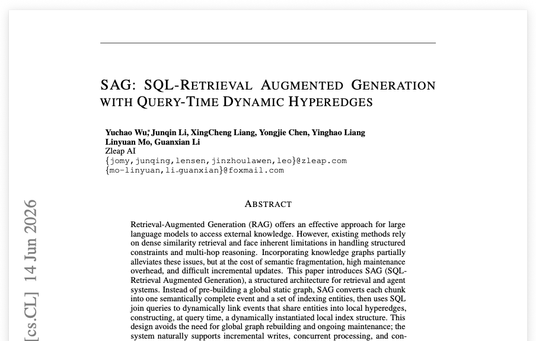
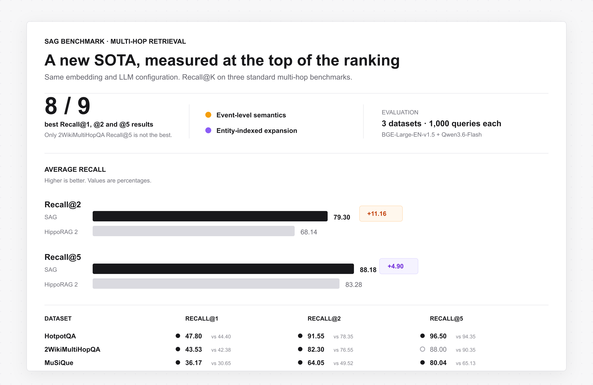
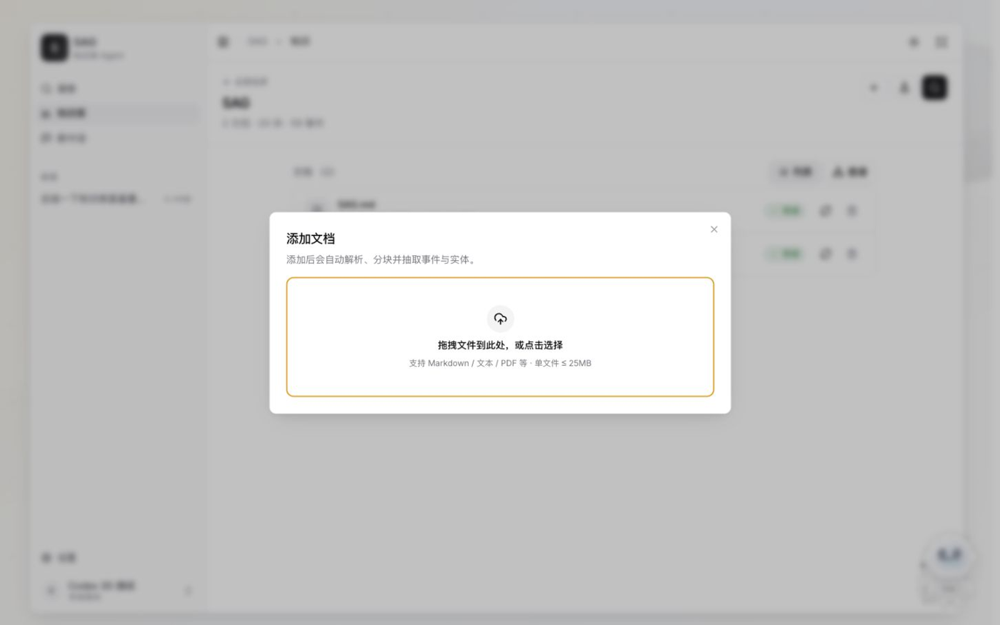
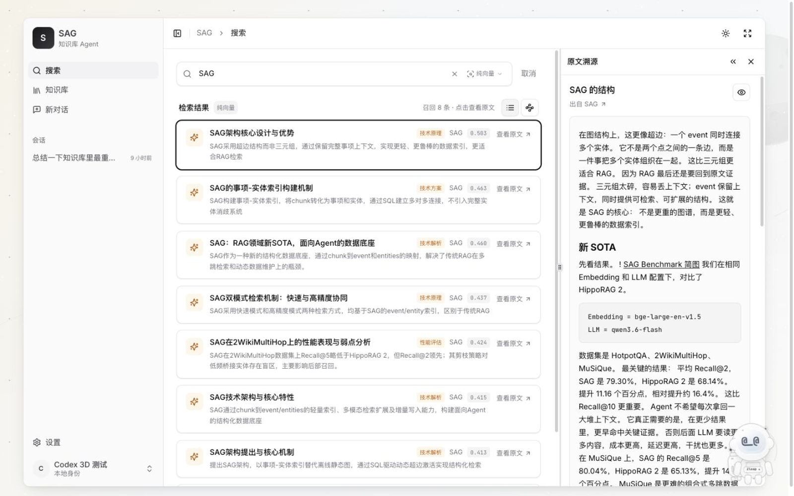
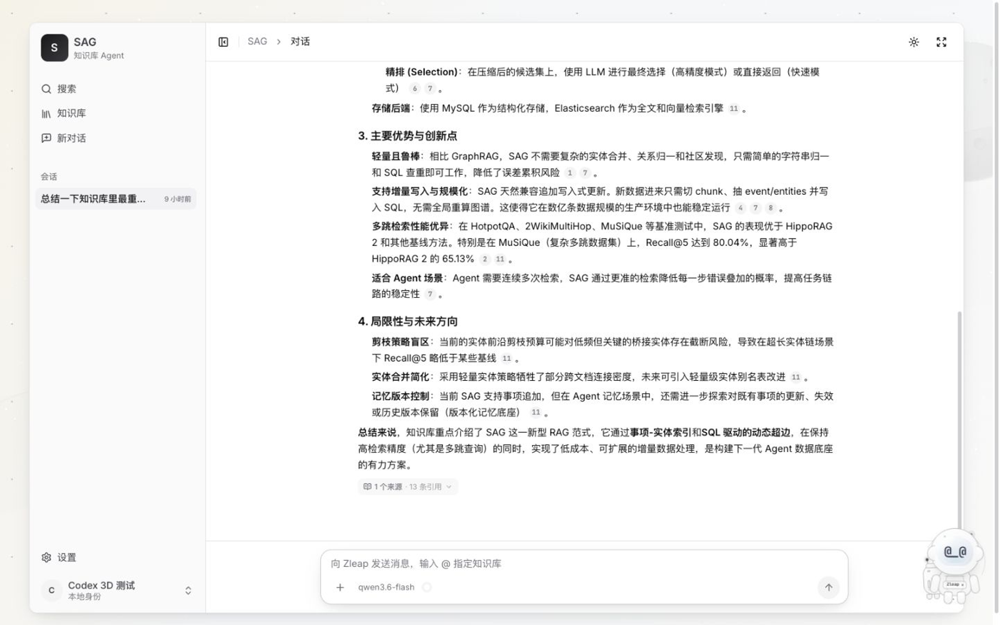
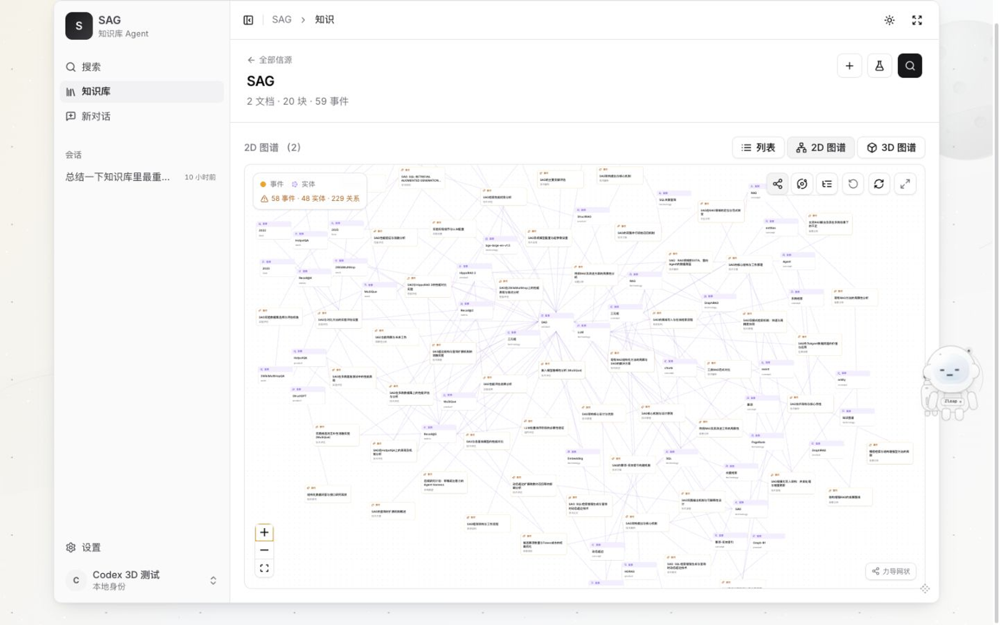
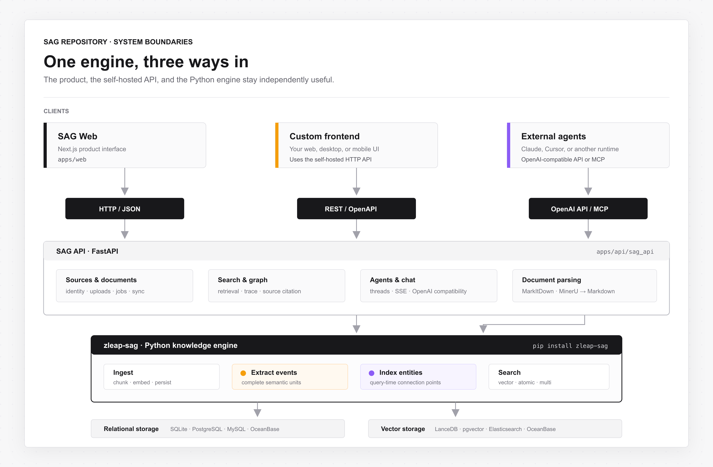

<p align="center">
  
</p>

<h1 align="center">SAG</h1>

<p align="center"><strong>你的最后一个知识库应用</strong></p>

<p align="center">
  开源、本地优先。把分散的文档与网页变成可搜索、可关联、可追溯的知识，并让 Agent 基于真实来源回答问题。
</p>

<p align="center">
  <strong>SAG 不是传统 RAG 与 GraphRAG 的融合，而是一套替代二者的原创检索架构。</strong>
</p>

<p align="center">
  它通过 event-entity 索引与查询时动态超边，在一个系统中同时实现语义检索与关系推理，不再需要维护两套 RAG 系统或拼接两路召回结果。
</p>

<p align="center">
  <a href="https://arxiv.org/abs/2606.15971"></a>
  <a href="https://pypi.org/project/zleap-sag/"></a>
  
  
  
  <a href="LICENSE"></a>
</p>

<p align="center">
  <strong>3 个多跳问答基准 · 8/9 项 Recall@K 最佳成绩 · Docker 一键部署</strong>
</p>

<p align="center"><sub>全新版本发布于 2026 年 7 月 12 日</sub></p>

<p align="center">
  <a href="README.md">English</a> · <strong>简体中文</strong>
</p>

<p align="center">
  <a href="#项目介绍">项目介绍</a> ·
  <a href="#技术原理">技术原理</a> ·
  <a href="#用户指南">用户指南</a> ·
  <a href="#开发者指南">开发者指南</a>
</p>

---

<a id="项目介绍"></a>

## 项目介绍

### 一分钟了解 SAG

SAG 是面向个人与 Agent 的完整知识库应用：

**信源与文档 → 结构化知识 → 检索与原文溯源 → 带引用的 Agent 回答 → 通过 API 或 MCP 复用**

文档只需上传一次。SAG 会自动解析、分块、向量化，抽取事件与实体，并让每一条检索结果都能回到原文。你可以跨信源搜索、查看 event-entity 图谱、进行带引用的问答，也可以把同一份知识开放给其他应用。

| 能力 | 解决的问题 |
| --- | --- |
| 知识导入 | 文件与网页信源、文档解析、分块、向量化、事件/实体抽取、后台处理 |
| 检索 | 全局或指定信源检索，支持 `vector`、`atomic`、`multi` 三种策略 |
| 原文溯源 | 每条检索结果和引用都能打开对应的原文块 |
| 知识图谱 | 查看事件、实体及其可查询的关联关系 |
| Agent 对话 | 基于指定信源进行多轮问答，并提供可点击引用 |
| 对外集成 | 自托管 REST/OpenAPI、OpenAI 兼容接口、MCP 与 `zleap-sag` Python 包 |

### 三个名称，三个边界

| 名称 | 含义 |
| --- | --- |
| **SAG** | 本仓库交付的完整应用，包括 Web、API、信源、检索、图谱、Agent 对话与集成能力 |
| **SAG 检索架构** | 论文提出的原创 event-entity 索引与查询时动态超边方法 |
| **`zleap-sag`** | 实现导入、抽取和检索能力的 Python 引擎，可用于 SAG，也可嵌入其他应用 |

产品默认面向本地单用户场景。它使用 SQLite 与 LanceDB 即可启动，不依赖外部数据库，同时保留迁移至 PostgreSQL/pgvector 等生产后端的路径。

---

<a id="技术原理"></a>

## 技术原理

### 论文

**SAG: SQL-Retrieval Augmented Generation with Query-Time Dynamic Hyperedges**<br>
Yuchao Wu、Junqin Li、XingCheng Liang、Yongjie Chen、Yinghao Liang、Linyuan Mo、Guanxian Li

[阅读论文](https://arxiv.org/abs/2606.15971) · [复现跑分](https://github.com/Zleap-AI/SAG-Benchmark)

<p align="center">
  <a href="https://arxiv.org/abs/2606.15971">
    
  </a>
</p>

### 一套原创的第三种架构

传统稠密 RAG 主要依靠语义相似度召回文本块。GraphRAG 在此基础上引入离线图谱构建，却要承担三元组抽取、实体合并、关系归一、全局维护和增量更新困难等成本。

SAG 不是对这两套系统的封装或组合。它用自己的数据模型和执行路径替代了这种选型：

```text
chunk → 一个语义完整的 event
chunk → 多个用于索引的 entities
event ↔ entities → 一条潜在超边
```

- **事件（event）**承载一个 chunk 的完整语义，不再被拆成彼此独立的三元组。
- **实体（entity）**只负责索引和扩展，不替代事件所承载的完整含义。
- **查询时动态超边**只在检索发生时，通过 SQL 将共享实体的事件连接成当前查询需要的局部结构。SAG 不预先构建、也不全局维护这些超边。
- **原文证据**始终是输出边界。被选中的事件最终映射回原始 chunk，用于生成回答和引用。

SAG 内部的语义路径和结构路径都是 SAG 自己检索管线的组成部分，并不是一套传统 RAG 服务和一套 GraphRAG 服务同时运行。

<p align="center">
  
</p>

### 检索流程

**离线索引**

1. 将文档解析为语义连贯的 chunks。
2. 从每个 chunk 并行抽取一个事件和多个实体。
3. 将 chunks、事件、实体和 event-entity 关联写入关系型存储。
4. 将 chunk、事件和实体表示写入向量与全文索引。

**在线检索**

1. 通过语义与词法信号找到种子实体和事件。
2. 使用 SQL 沿共享实体扩展种子事件，形成局部候选空间。
3. 只实例化当前查询需要的超边，不进行全局图遍历或重建。
4. 从事件候选与直接 chunk 候选中选出最强证据，去重后返回原文块。

因此，增量写入不需要重算全局图谱。每个新 chunk 只需加入自己的事件、实体和关联即可。

### 多跳检索新 SOTA

在相同的 `BGE-Large-EN-v1.5` Embedding 与 `Qwen3.6-Flash` LLM 配置下，SAG 在 HotpotQA、2WikiMultiHopQA 和 MuSiQue 的 **9 项 Recall@1/2/5 指标中取得 8 项最佳成绩**。平均 Recall@2/Recall@5 达到 **79.30%/88.18%**，HippoRAG 2 为 **68.14%/83.28%**。

<p align="center">
  
</p>

下面是“8/9 项最佳成绩”对应的九项完整数据。粗体代表该数据集和 K 值下的最佳成绩。

| 数据集 | 方法 | Recall@1 | Recall@2 | Recall@5 |
| --- | --- | ---: | ---: | ---: |
| HotpotQA | **SAG** | **47.80%** | **91.55%** | **96.50%** |
| HotpotQA | HippoRAG 2 | 44.40% | 78.35% | 94.35% |
| 2WikiMultiHopQA | **SAG** | **43.53%** | **82.30%** | 88.00% |
| 2WikiMultiHopQA | HippoRAG 2 | 42.38% | 76.55% | **90.35%** |
| MuSiQue | **SAG** | **36.17%** | **64.05%** | **80.04%** |
| MuSiQue | HippoRAG 2 | 30.65% | 49.52% | 65.13% |
| **平均** | **SAG** | **42.50%** | **79.30%** | **88.18%** |
| **平均** | HippoRAG 2 | 39.14% | 68.14% | 83.28% |

评估说明：

- 每个数据集均从官方开发集抽取 1,000 个问题。
- Recall@K 使用论文定义的 any-hit 段落召回标准。
- SAG 在九项核心指标中唯一没有取得最佳成绩的是 2WikiMultiHopQA Recall@5。
- 在最长包含四跳、且中间步骤不可跳过的 MuSiQue 上，SAG Recall@5 为 80.04%，HippoRAG 2 为 65.13%。
- 完整方法与局限性见[论文](https://arxiv.org/abs/2606.15971)；复现脚本和 Recall@1/2/5/10 完整数据见 [SAG-Benchmark](https://github.com/Zleap-AI/SAG-Benchmark)。

---

<a id="用户指南"></a>

## 用户指南

### 导入知识

创建信源后，可以添加 Markdown、文本、PDF、Office 等支持的文档。SAG 会先将文档规范化为 Markdown，再在后台完成分块、向量化、事件抽取和实体抽取。

<p align="center">
  
</p>

PDF 在 MinerU 配置完整时优先使用 MinerU；未配置或解析失败时自动回退本地 MarkItDown。其他 Office 和文本格式默认使用 MarkItDown。

### 检索并核对原文

可以跨全部信源检索，也可以只搜索指定信源。每一条结果都能在右侧打开对应原文块，让 Agent 使用前的召回质量可以被直接核验。

<p align="center">
  
</p>

### 进行带引用的问答

默认 Agent 会检索绑定的知识来源、流式生成回答，并附上可点击引用。同一套对话能力也通过 OpenAI 兼容接口开放。

<p align="center">
  
</p>

### 查看 event-entity 图谱

在信源中从列表切换到图谱，可以查看 SAG 索引生成的事件、实体和关联关系。

<p align="center">
  
</p>

### 通过 Docker 部署

准备 Docker Desktop，或 Docker Engine 与 Compose v2。

```bash
git clone https://github.com/Zleap-AI/SAG.git
cd SAG
docker compose up -d --build
```

启动应用不需要提前准备 API Key、Python、Node 或外部数据库。两个服务健康后打开：

- Web 应用：[http://localhost:3000](http://localhost:3000)
- API 文档：[http://localhost:8000/docs](http://localhost:8000/docs)

首次使用：

1. 填写名字，创建或恢复本地身份。
2. 使用 302.AI 快速配置，或进入 **设置 → 模型**，填写任意 OpenAI 兼容的 LLM 与 Embedding 接口。
3. 创建信源并上传文档，等待状态变为**就绪**。
4. 开始检索、打开原文，或直接进行带引用的对话。

没有模型密钥时，界面和服务仍可启动。Embedding 用于索引与向量检索；LLM 用于事件抽取、查询理解和生成回答。

### 运行与更新

```bash
docker compose ps                  # api 和 web 应显示 healthy
docker compose logs -f api web     # 持续查看日志
docker compose restart             # 重启服务
docker compose down                # 停止并保留全部数据

git pull --ff-only                 # 更新本地代码
docker compose up -d --build       # 重建服务，不删除数据卷
```

默认持久化方式：

| 运行方式 | 应用元数据 | 知识引擎 | 保存位置 |
| --- | --- | --- | --- |
| Docker 默认 | SQLite | SQLite + LanceDB | Docker 数据卷 `sagdata` |
| 本地开发 | SQLite | SQLite + LanceDB | `apps/api/.data/` |
| PostgreSQL 覆盖 | PostgreSQL | PostgreSQL + pgvector | `pgdata` 与 `sagdata` 数据卷 |

`docker compose down` 会保留数据。**`docker compose down -v` 会永久删除数据库、知识索引和已上传文件。**

### 网络与生产安全

默认 Compose 只将 3000 和 8000 端口绑定到 `127.0.0.1`。SAG 当前是本地单用户产品，不要把这两个端口直接暴露到公网。

需要自定义端口或在受信局域网访问时：

```bash
cp .env.example .env
# 修改 BIND_ADDRESS、WEB_PORT、API_PORT、SAG_CORS_ORIGINS 和 NEXT_PUBLIC_API_BASE。
docker compose up -d --build
```

`NEXT_PUBLIC_API_BASE` 会在构建时写入 Web 镜像，因此修改后必须带 `--build`。服务器部署还应配置 HTTPS，以及 VPN、IP 白名单或反向代理认证等外部访问控制。

---

<a id="开发者指南"></a>

## 开发者指南

### 系统边界

SAG 采用 Next.js 前端与 FastAPI 后端分离的架构。后端是基于公开 Python 引擎 `zleap-sag` 制作的参考应用。开发者既可以保留整个后端、制作自己的前端，也可以在自己的 Python 服务中直接嵌入 `zleap-sag`。

<p align="center">
  
</p>

### 代码库结构

```text
apps/
├── web/                    Next.js 15 + React 19 产品前端
└── api/
    ├── sag_api/
    │   ├── api/v1/         FastAPI HTTP 路由与序列化
    │   ├── connectors/     文件/网页信源连接器与注册表
    │   ├── parsing/        MarkItDown 与 MinerU 文档规范化
    │   ├── jobs/           后台 ingest → extract 状态机
    │   ├── sag/            应用内唯一导入 zleap-sag 的适配层
    │   ├── generation/     检索证据 → 流式带引用回答
    │   ├── mcp/            知识库 MCP Server 与 HTTP 挂载
    │   ├── services/       应用与领域编排
    │   └── tools/          内置工具与远端 MCP Agent 工具
    └── sag_agent/          与框架无关的 Agent Runtime Core
skills/sag/                 通过 MCP 探索 SAG 的 Agent Skill
deploy/                     部署初始化资源
docs/                       架构与工程规范
```

核心依赖规则很简单：应用只能通过 `apps/api/sag_api/sag/` 访问知识引擎；引擎不知道 FastAPI、Web UI、用户、对话和引用的存在。

### 本地开发

从仓库根目录分别启动后端和前端。

```bash
# 终端 1：API，地址 http://localhost:8000
cd apps/api
python -m venv .venv
. .venv/bin/activate
pip install -e ".[dev]"
cp .env.example .env
uvicorn sag_api.main:app --reload
```

```bash
# 终端 2：Web，地址 http://localhost:3000
cd apps/web
npm install
npm run dev
```

常用检查：

```bash
cd apps/api && pytest
cd apps/api && ruff check .
cd apps/web && npm run typecheck
cd apps/web && npm run build
```

### 直接使用 `zleap-sag`

[`zleap-sag`](https://pypi.org/project/zleap-sag/) 是 SAG 应用底层持续维护的 Python 引擎。发行包名为 `zleap-sag`，导入路径为 `zleap.sag`，要求 Python 3.11+，采用 MIT 许可。当前应用要求 `zleap-sag>=0.7.1`。

安装默认的零基础设施版本：

```bash
pip install zleap-sag
```

运行完整的导入 → 抽取 → 检索流程：

```python
import asyncio

from zleap.sag import DataEngine, EngineConfig
from zleap.sag.config import EmbeddingConfig, LLMConfig


async def main() -> None:
    config = EngineConfig(
        llm=LLMConfig(
            api_key="sk-...",
            base_url="https://your-openai-compatible-host/v1",
            model="qwen3.6-flash",
        ),
        # 不填写 api_key/base_url 时，Embedding 会复用 LLM 接口。
        embedding=EmbeddingConfig(model="bge-large-en-v1.5"),
        language="zh",
    )

    # 一个 DataEngine 实例对应一个逻辑信源。
    async with DataEngine(config) as engine:
        ingest = await engine.ingest("knowledge.md")
        extract = await engine.extract()
        result = await engine.search(
            "SAG 为什么适合多跳检索？",
            strategy="multi",
            top_k=5,
        )

        print(ingest.chunk_count, extract.event_count)
        for section in result.sections:
            print(section.get("content", "")[:200])


asyncio.run(main())
```

本地数据会自动创建在 `./.zleap/`，请将该目录加入 `.gitignore`。

#### 配置方式

两种配置方式选择其一，不要混用：

| 方式 | 创建方法 | 适用场景 |
| --- | --- | --- |
| 参数注入 | `EngineConfig(llm=..., embedding=...)` | Python 库、Notebook、显式应用装配 |
| 环境变量 | `EngineConfig.from_env()` 或 `from_env(env_file=".env")` | 容器与 12-factor 服务 |

最小环境变量配置：

```bash
export OPENAI_API_KEY=sk-...
export OPENAI_BASE_URL=https://your-openai-compatible-host/v1
export LLM_MODEL=qwen3.6-flash
export EMBEDDING_MODEL=bge-large-en-v1.5
```

```python
from zleap.sag import EngineConfig

config = EngineConfig.from_env()
```

`EngineConfig(...)` 不会自动读取环境变量。请使用显式参数，或调用 `from_env()`。独立的 Embedding 接口可以通过 `EmbeddingConfig(api_key=..., base_url=..., model=...)` 配置。

#### `DataEngine` 公共 API

| API | 作用 |
| --- | --- |
| `await engine.start()` | 初始化连接；本地 SQLite/LanceDB 会自动创建结构 |
| `await engine.aclose()` | 关闭引擎资源；使用 `async with` 时自动执行 |
| `await engine.chunk(source)` | 解析并分块路径或原始字符串，但不写入数据库 |
| `await engine.ingest(path, ...)` | 解析单个文档、分块、向量化并持久化 chunks/vectors |
| `await engine.extract(...)` | 为当前信源抽取并保存 event-entity 索引 |
| `await engine.search(query, strategy=..., top_k=...)` | 返回带 `sections` 和耗时/统计信息的 `SearchResult` |
| `await engine.init_schema()` | 幂等初始化生产数据库结构；默认本地后端不需要调用 |

类型化结果位于 `zleap.sag.results`：`ChunkResult`、`IngestResult`、`ExtractResult`、`SearchResult`。所有引擎异常都继承 `SagError`，应用边界只需捕获一个基础类型。

#### 检索策略

| 界面名称 | Python strategy | 代码实现 |
| --- | --- | --- |
| 纯向量 | `vector` | 直接对原始 chunks 做向量召回，跳过实体扩展，响应最快 |
| 原子检索 | `atomic` | 召回事件中恰好包含两个实体的原子化、类三元组事实，再由 LLM 精选 |
| 图谱增强 | `multi` | SAG 原生的多实体事件召回，沿共享实体做 SQL 扩展，再完成最终选择 |

界面上的**图谱增强**实际映射到 SAG 的 `multi` 策略，并不会运行一套独立的 GraphRAG。引擎还提供 `multi1`、`hopllm`、`multi_es` 等高级策略，仅在确实需要对应后端或候选流取舍时使用。

#### 存储后端

| 部署方式 | 关系型存储 | 向量存储 | 安装 extra |
| --- | --- | --- | --- |
| 本地默认 | SQLite | LanceDB | 无 |
| 单数据库 | PostgreSQL | pgvector | `zleap-sag[postgres]` |
| 生产拆分 | MySQL/PostgreSQL/OceanBase | Elasticsearch | `zleap-sag[mysql]`、`[postgres]`、`[es]` |
| 单数据库 | OceanBase 4.3.3+ | OceanBase vector | `zleap-sag[mysql]` |

只需修改 `EngineConfig` 即可切换后端，导入、抽取和检索代码保持不变。当前引擎连接是进程级全局资源，因此一个进程只使用一份 `EngineConfig`。

完整配置、可选依赖、示例和更新记录见 [`zleap-sag` 包说明](https://pypi.org/project/zleap-sag/)。

### 基于 SAG 后端制作自己的前端

浏览器不能直接导入 Python 包。自定义前端应调用一个持有 `DataEngine` 的 Python HTTP 服务。本仓库的 FastAPI 后端就是参考实现，并且已经与 Next.js 前端分离。

启动 SAG 后即可使用自托管 API：

| 入口 | 地址 |
| --- | --- |
| API Base | `http://localhost:8000/api/v1` |
| 交互式 OpenAPI | [http://localhost:8000/docs](http://localhost:8000/docs) |
| OpenAPI Schema | [http://localhost:8000/openapi.json](http://localhost:8000/openapi.json) |
| MCP Streamable HTTP | `http://localhost:8000/mcp/` |

这是**自托管 API**，不是由项目方托管的公共云 API。大部分接口需要 SAG JWT：

```bash
curl -s http://localhost:8000/api/v1/auth/login \
  -H 'Content-Type: application/json' \
  -d '{"name":"Developer"}'
```

从响应中复制 `access_token`，后续请求携带：

```http
Authorization: Bearer <SAG_TOKEN>
```

#### API 地图

| 领域 | 主要路由 | 用途 |
| --- | --- | --- |
| 系统 | `GET /system/health`、`/system/ready`、`/system/capabilities` | 健康状态与当前引擎能力 |
| 身份 | `POST /auth/login`、`GET /auth/me` | 本地身份与 JWT |
| 信源 | `GET/POST /sources`、`GET/PATCH/DELETE /sources/{id}` | 信源生命周期 |
| 文档 | `/sources/{id}/documents` 与 `/documents/ingest` | 文件上传、持续文本/消息写入、重新处理、删除 |
| 检索 | `POST /search`、`POST /sources/{id}/search` | 全局或指定信源的 `vector`/`atomic`/`multi` 检索 |
| 图谱 | `GET /sources/{id}/entities`、`/sources/{id}/graph` | 查看 event-entity 结构 |
| Agent | `/agents`、`/threads`、`/ask` | Agent 配置、会话、SSE 运行与引用 |
| OpenAI 兼容 | `POST /openai/{agent_id}/chat/completions` | 将任意 SAG Agent 作为带引用模型调用，支持流式 |
| MCP | `/mcp/` 或 `/mcp/?source_id={id}` | 将整个知识库或单个信源开放给 MCP 宿主 |

创建信源、持续写入文本并执行检索：

```bash
BASE=http://localhost:8000/api/v1
TOKEN=<SAG_TOKEN>

SOURCE_ID=$(curl -s -X POST "$BASE/sources" \
  -H "Authorization: Bearer $TOKEN" \
  -H 'Content-Type: application/json' \
  -d '{"name":"Product docs"}' | jq -r .id)

curl -s -X POST "$BASE/sources/$SOURCE_ID/documents/ingest" \
  -H "Authorization: Bearer $TOKEN" \
  -H 'Content-Type: application/json' \
  -d '{"title":"SAG","text":"SAG 使用 event-entity 索引与查询时动态超边。"}'

curl -s -X POST "$BASE/sources/$SOURCE_ID/search" \
  -H "Authorization: Bearer $TOKEN" \
  -H 'Content-Type: application/json' \
  -d '{"query":"SAG 如何检索知识？","strategy":"multi","top_k":5}'
```

文档写入由后台任务队列处理。在期待检索结果前，请检查返回的文档状态或对应任务是否完成。

通过 OpenAI 兼容接口调用 Agent：

```bash
curl -s -X POST "$BASE/openai/<AGENT_ID>/chat/completions" \
  -H "Authorization: Bearer $TOKEN" \
  -H 'Content-Type: application/json' \
  -d '{
    "messages":[{"role":"user","content":"总结已经索引的证据。"}],
    "stream":false
  }'
```

响应遵循 Chat Completions 结构，并额外提供 `sag.citations`；标准客户端可以忽略这个扩展字段。设置 `stream: true` 后使用 SSE 返回。

使用 MCP 时，将 Streamable HTTP Server 配置为 `http://localhost:8000/mcp/`，添加 `Authorization: Bearer <SAG_TOKEN>`；需要限定单个信源时追加 `?source_id=<SOURCE_ID>`。

如果自定义前端与 API 不同源，请将前端地址加入 `SAG_CORS_ORIGINS`。API 地址改变时，还要用对应的 `NEXT_PUBLIC_API_BASE` 重新构建 Web 镜像。

### PostgreSQL/pgvector 部署

可选的生产覆盖会将应用元数据与知识引擎迁移到 PostgreSQL/pgvector：

```bash
cp .env.example .env
openssl rand -hex 32   # 填入 SAG_SECRET_KEY
openssl rand -hex 24   # 填入 POSTGRES_PASSWORD

docker compose -f compose.yaml -f compose.postgres.yaml config
docker compose -f compose.yaml -f compose.postgres.yaml up -d --build
```

服务器部署前应设置真实的 `SAG_CORS_ORIGINS` 与 `NEXT_PUBLIC_API_BASE`。升级前同时备份 `pgdata` 和 `sagdata`。

---

## 参与贡献与许可

- 贡献流程：[CONTRIBUTING.md](CONTRIBUTING.md)
- 架构文档：[docs/architecture.md](docs/architecture.md)
- 工程规范：[docs/standards/](docs/standards/README.md)
- Python 引擎：[`zleap-sag` PyPI](https://pypi.org/project/zleap-sag/)
- 论文复现：[Zleap-AI/SAG-Benchmark](https://github.com/Zleap-AI/SAG-Benchmark)

SAG 使用 [MIT License](LICENSE)。
