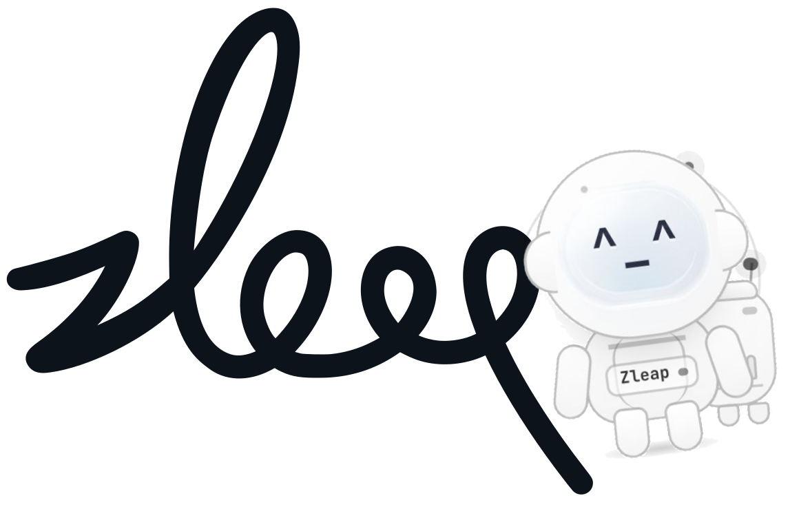
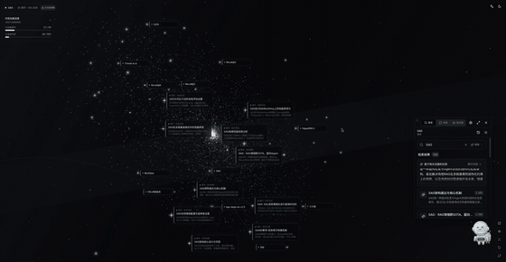
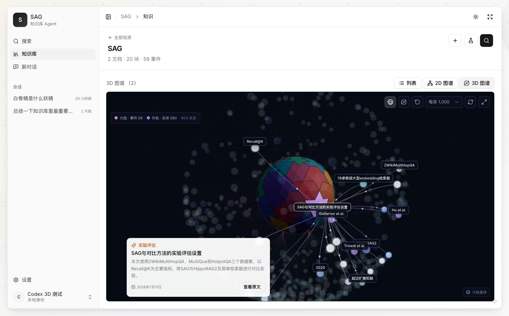
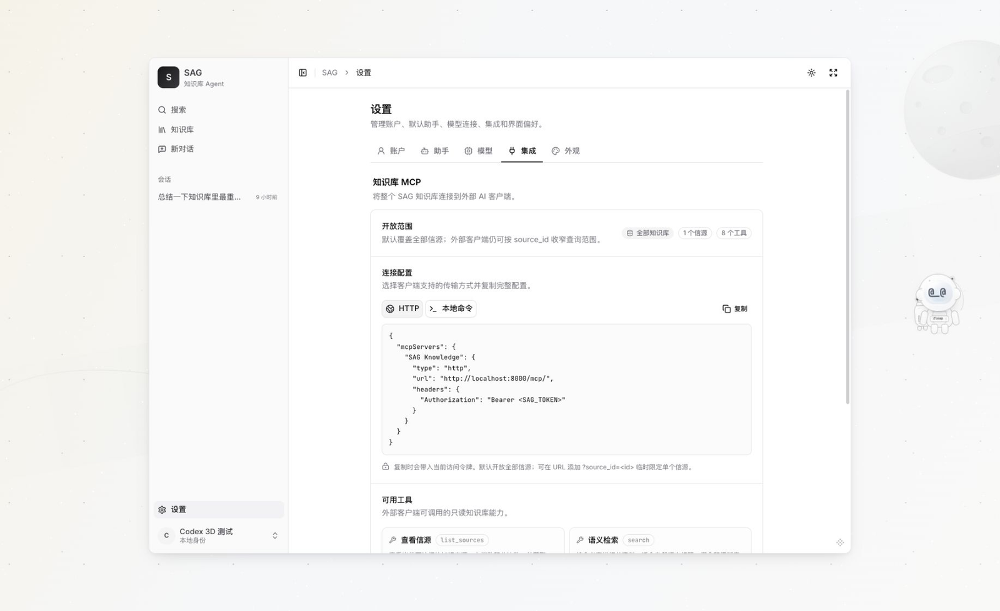

<p align="center">
  
</p>

<h1 align="center">SAG</h1>

<p align="center">
  <strong>English</strong> · <a href="README-CN.md">简体中文</a>
</p>

<p align="center">
  <a href="https://arxiv.org/abs/2606.15971"></a>
  <a href="https://pypi.org/project/zleap-sag/"></a>
  
  
  
  <a href="LICENSE"></a>
</p>

<p align="center"><strong>From now on, this is the only knowledge base app you need.</strong></p>

<p align="center">
  Built on the state-of-the-art SAG architecture, it turns scattered documents and data into knowledge that is searchable, connected, and traceable.
</p>

https://github.com/user-attachments/assets/9bb618e9-fef8-4d07-8a30-3f7d83beb0ff

## Contents

<p align="center">
  <a href="#project">Project</a> ·
  <a href="#technology">Technology</a> ·
  <a href="#user-guide">User Guide</a> ·
  <a href="#developer-guide">Developer Guide</a>
</p>

---

<a id="project"></a>

## Project

### Changelog

**July 14, 2026**

Released a completely new version built on the `zleap-sag` package, featuring an entirely redesigned UI. The previous version has been archived in the `v1` branch and is no longer maintained.

### SAG in one minute

SAG is not a fusion of traditional RAG and GraphRAG. It is an original retrieval architecture that replaces both.

Through event-entity indexing and query-time dynamic hyperedges, SAG delivers semantic retrieval and relational reasoning in one system, without maintaining two RAG systems or merging two retrieval paths.

SAG achieves the best result on 8 of the 9 Recall@1/2/5 metrics across HotpotQA, 2WikiMultiHopQA, and MuSiQue, establishing a new state of the art for RAG.

This project is a complete knowledge base application for individuals and Agents built on SAG:

**sources and documents → structured knowledge → search and source tracing → cited Agent answers → reuse through API or MCP**

Upload a document once. SAG parses it, splits it into chunks, embeds it, extracts events and entities, and keeps every retrieval result connected to the original text. You can then search across sources, inspect the event-entity graph, ask questions with citations, or expose the same knowledge to another application.

| Capability | What it gives you |
| --- | --- |
| Knowledge ingestion | File and web sources, document parsing, chunking, embedding, event/entity extraction, background processing |
| Search | Global or source-scoped retrieval with Fast (`vector`) and Precise (`multi`) modes |
| Source tracing | Open any result or citation back to the exact original chunk |
| Knowledge graph | Inspect events, entities, and their queryable associations |
| Agent chat | Multi-turn answers grounded in selected sources, with clickable citations |
| Integration | Self-hosted REST/OpenAPI, OpenAI-compatible chat, MCP, and the `zleap-sag` Python package |

The product is deliberately local-first and single-user. It starts with SQLite and LanceDB, requires no external database, and keeps a clear path to PostgreSQL/pgvector and other production backends.

---

<a id="technology"></a>

## Technology

### Paper

**SAG: SQL-Retrieval Augmented Generation with Query-Time Dynamic Hyperedges**<br>
Yuchao Wu, Junqin Li, XingCheng Liang, Yongjie Chen, Yinghao Liang, Linyuan Mo, and Guanxian Li

[Read the paper](https://arxiv.org/abs/2606.15971) · [Reproduce the benchmark](https://github.com/Zleap-AI/SAG-Benchmark)

<p align="center">
  <a href="https://arxiv.org/abs/2606.15971">
    
  </a>
</p>

### An original third architecture

Traditional dense RAG retrieves chunks mainly by semantic similarity. GraphRAG adds offline graph construction, but pays for triple extraction, entity merging, relation normalization, global maintenance, and difficult incremental updates.

SAG does not wrap those two systems. It replaces that choice with its own data model and execution path:

```text
chunk → one semantically complete event
chunk → multiple indexing entities
event ↔ entities → one latent hyperedge
```

- **Event** carries the complete meaning of a chunk. It is not fragmented into independent triples.
- **Entity** is a lightweight index and expansion point, not a replacement for the event's meaning.
- **Query-time dynamic hyperedge** is created locally when SQL joins events that share entities around the current query. SAG does not pre-build or globally maintain those hyperedges.
- **Original evidence** remains the output boundary. Selected events always map back to source chunks for generation and citation.

The semantic and structural paths inside SAG are native parts of the SAG pipeline. They are not a traditional RAG service and a GraphRAG service running side by side.

<p align="center">
  
</p>

### How retrieval works

**Offline indexing**

1. Parse a document into semantically coherent chunks.
2. Extract one event and multiple entities from each chunk in parallel.
3. Persist chunks, events, entities, and event-entity associations to relational storage.
4. Persist chunk, event, and entity representations to vector/full-text indexes.

**Online retrieval**

1. Find seed entities and events using semantic and lexical signals.
2. Use SQL joins over shared entities to expand from seed events into a local candidate space.
3. Instantiate only the hyperedges relevant to this query; no global graph traversal or rebuild is required.
4. Select the strongest event and direct-chunk candidates, deduplicate them, and return the original evidence chunks.

This makes incremental writes natural: a new chunk adds its own event, entities, and associations without recomputing a global graph.

### A new SOTA for RAG

Under the same `BGE-Large-EN-v1.5` embedding and `Qwen3.6-Flash` LLM configuration, SAG reports the best result on **8 of 9 Recall@1/2/5 metrics** across HotpotQA, 2WikiMultiHopQA, and MuSiQue. Its average Recall@2/Recall@5 is **79.30%/88.18%**, compared with HippoRAG 2 at **68.14%/83.28%**.

Full results:

| Dataset | Method | Recall@1 | Recall@2 | Recall@5 |
| --- | --- | ---: | ---: | ---: |
| HotpotQA | **SAG** | **47.80%** | **91.55%** | **96.50%** |
| HotpotQA | HippoRAG 2 | 44.40% | 78.35% | 94.35% |
| 2WikiMultiHopQA | **SAG** | **43.53%** | **82.30%** | 88.00% |
| 2WikiMultiHopQA | HippoRAG 2 | 42.38% | 76.55% | **90.35%** |
| MuSiQue | **SAG** | **36.17%** | **64.05%** | **80.04%** |
| MuSiQue | HippoRAG 2 | 30.65% | 49.52% | 65.13% |
| **Average** | **SAG** | **42.50%** | **79.30%** | **88.18%** |
| **Average** | HippoRAG 2 | 39.14% | 68.14% | 83.28% |

See the [paper](https://arxiv.org/abs/2606.15971) and [SAG-Benchmark](https://github.com/Zleap-AI/SAG-Benchmark) for the full method and reproduction scripts.

---

<a id="user-guide"></a>

## User Guide

### Quick start (Docker, recommended)

Requirements: Docker Desktop, or Docker Engine with Compose v2.

```bash
git clone https://github.com/Zleap-AI/SAG.git
cd SAG
docker compose up -d --build
```

No API key, Python runtime, Node runtime, or external database is required to boot the application. When both services are healthy, open:

- Web application: [http://localhost:3000](http://localhost:3000)
- API documentation: [http://localhost:8000/docs](http://localhost:8000/docs)

On first launch:

1. Enter your name to create or restore the local identity.
2. Use the 302.AI quick setup, or open **Settings → Models** and configure any OpenAI-compatible LLM and embedding endpoint.
3. Create a source, upload documents, and wait until their status is **Ready**.
4. Search, open the original source, or start a cited conversation.

The UI and services still start without model credentials. Embeddings are required for indexing/vector retrieval; the LLM is required for event extraction, query understanding, and generated answers.

### Import knowledge

Create a source and add Markdown, text, PDF, Office, or other supported documents. SAG normalizes documents to Markdown, then runs chunking, embedding, event extraction, and entity extraction in the background.

<p align="center">
  
</p>

PDF files use MinerU when it is configured and fall back to local MarkItDown when it is unavailable or fails. Other Office and text formats use MarkItDown by default.

### Search and verify the source

Search globally or restrict the query to selected sources. Every result can open the original chunk beside the ranked result, so retrieval quality is inspectable before an Agent uses it.

<p align="center">
  
</p>

### Ask with citations

The default Agent searches the bound knowledge sources, streams the answer, and attaches clickable citations. The same conversation path is also available through an OpenAI-compatible endpoint.

<p align="center">
  
</p>

### Explore mode

Explore mode unfolds the entire knowledge base into an interactive knowledge universe. Search events and entities, travel through their relationships, and open event details or original sources without leaving the same view.

<p align="center">
  
</p>

### Explore the event-entity graph

Switch a source from list view to graph view to inspect the events, entities, and associations produced by the SAG index.

<p align="center">
  
</p>

<p align="center">
  
</p>

### MCP guide

#### Use as an Agent Skill (Claude Code, Codex, and others)

SAG ships an official Skill in [`skills/sag/`](skills/sag/). It teaches an Agent to use eight read-only MCP tools: call `list_sources` to confirm the accessible scope, then follow the `list_documents → outline → search/grep → get_chunk/read` exploration funnel to locate and cite knowledge.

Copy the directory into your Agent's skills directory:

```bash
# Claude Code
cp -R skills/sag ~/.claude/skills/sag-knowledge

# Codex
cp -R skills/sag ~/.codex/skills/sag-knowledge
```

#### Mount MCP directly in an Agent

The Skill is optional. In SAG, open **Settings → Integrations → Knowledge MCP**, select HTTP or local command, and copy the complete configuration. The copied HTTP configuration includes the current JWT, exposes all sources by default, and can be scoped with `source_id`.

<p align="center">
  
</p>

### Use SAG as a model (OpenAI-compatible)

SAG exposes an OpenAI Chat Completions endpoint with the same retrieval and citation behavior as the built-in chat:

```bash
curl -s http://localhost:8000/api/v1/openai/<AGENT_ID>/chat/completions \
  -H "Authorization: Bearer <SAG_JWT>" \
  -H "Content-Type: application/json" \
  -d '{"messages":[{"role":"user","content":"What is this material about?"}]}'
```

The response is a standard `chat.completion` with an additional `sag.citations` field; standard clients ignore unknown fields. Set `"stream": true` to receive SSE chunks.

### Operate and update

```bash
docker compose ps                  # api and web should be healthy
docker compose logs -f api web     # follow logs
docker compose restart             # restart services
docker compose down                # stop and keep all data

git pull --ff-only                 # update the source checkout
docker compose up -d --build       # rebuild without deleting volumes
```

Default persistence:

| Runtime | Application metadata | Knowledge engine | Location |
| --- | --- | --- | --- |
| Docker default | SQLite | SQLite + LanceDB | Docker volume `sagdata` |
| Local development | SQLite | SQLite + LanceDB | `apps/api/.data/` |
| PostgreSQL override | PostgreSQL | PostgreSQL + pgvector | `pgdata` and `sagdata` volumes |

`docker compose down` preserves data. **`docker compose down -v` permanently deletes the database, knowledge index, and uploaded files.**

### Network and production safety

The default Compose configuration binds ports 3000 and 8000 to `127.0.0.1`. SAG is currently a local, single-user product; do not expose those ports directly to the public internet.

For custom ports or a trusted LAN address:

```bash
cp .env.example .env
# Edit BIND_ADDRESS, WEB_PORT, API_PORT, SAG_CORS_ORIGINS, and NEXT_PUBLIC_API_BASE.
docker compose up -d --build
```

`NEXT_PUBLIC_API_BASE` is compiled into the web image, so changing it requires `--build`. A server deployment should add HTTPS and an external access-control layer such as VPN, IP allowlisting, or reverse-proxy authentication.

---

<a id="developer-guide"></a>

## Developer Guide

### System boundaries

SAG has a separated Next.js frontend and FastAPI backend. The backend is a reference application built on the public `zleap-sag` Python engine. You can reuse the complete backend from another frontend, or embed `zleap-sag` directly in a Python service of your own.

<p align="center">
  
</p>

### Repository map

```text
apps/
├── web/                    Next.js 15 + React 19 product UI
└── api/
    ├── sag_api/
    │   ├── api/v1/         FastAPI HTTP routes and serialization
    │   ├── connectors/     File/web source connectors and registry
    │   ├── parsing/        MarkItDown and MinerU normalization
    │   ├── jobs/           Background ingest → extract state machine
    │   ├── sag/            The only application adapter importing zleap-sag
    │   ├── generation/     Retrieved evidence → streamed cited answer
    │   ├── mcp/            Knowledge MCP server and HTTP mount
    │   ├── services/       Application/domain orchestration
    │   └── tools/          Built-in and remote MCP Agent tools
    └── sag_agent/          Framework-independent Agent runtime core
skills/sag/                 Agent Skill for exploring SAG through MCP
deploy/                     Deployment initialization assets
docs/assets/readme/         README screenshots and diagrams
```

The central dependency rule is simple: application code reaches the engine through `apps/api/sag_api/sag/`; the engine does not know about FastAPI, the Web UI, users, conversations, or citations.

### Local development

Start the backend and frontend in separate terminals from the repository root.

```bash
# Terminal 1: API at http://localhost:8000
cd apps/api
python -m venv .venv
. .venv/bin/activate
pip install -e ".[dev]"
cp .env.example .env
uvicorn sag_api.main:app --reload
```

```bash
# Terminal 2: Web at http://localhost:3000
cd apps/web
npm install
npm run dev
```

Useful checks:

```bash
cd apps/api && ruff check .
cd apps/web && npm run typecheck
cd apps/web && npm run build
```

### Use `zleap-sag` directly

[`zleap-sag`](https://pypi.org/project/zleap-sag/) is the continuously maintained Python engine behind the SAG application. Distribution name: `zleap-sag`; import path: `zleap.sag`; Python: 3.11+; license: MIT. The application currently requires `zleap-sag>=0.7.1`.

Install the zero-infrastructure local stack:

```bash
pip install zleap-sag
```

Then run the complete ingest → extract → search lifecycle:

```python
import asyncio

from zleap.sag import DataEngine, EngineConfig
from zleap.sag.config import EmbeddingConfig, LLMConfig


async def main() -> None:
    config = EngineConfig(
        llm=LLMConfig(
            api_key="sk-...",
            base_url="https://your-openai-compatible-host/v1",
            model="qwen3.6-flash",
        ),
        # When api_key/base_url are omitted, embedding reuses the LLM endpoint.
        embedding=EmbeddingConfig(model="bge-large-en-v1.5"),
        language="en",
    )

    # One DataEngine instance represents one logical data source.
    async with DataEngine(config) as engine:
        ingest = await engine.ingest("knowledge.md")
        extract = await engine.extract()
        result = await engine.search(
            "Why is SAG effective for multi-hop retrieval?",
            strategy="multi",
            top_k=5,
        )

        print(ingest.chunk_count, extract.event_count)
        for section in result.sections:
            print(section.get("content", "")[:200])


asyncio.run(main())
```

Local storage is created automatically under `./.zleap/`. Add that directory to `.gitignore`.

#### Configuration

Use one configuration style, not both:

| Style | Construction | Best for |
| --- | --- | --- |
| Parameter injection | `EngineConfig(llm=..., embedding=...)` | Libraries, notebooks, explicit application wiring |
| Environment | `EngineConfig.from_env()` or `from_env(env_file=".env")` | Containers and 12-factor services |

Minimal environment configuration:

```bash
export OPENAI_API_KEY=sk-...
export OPENAI_BASE_URL=https://your-openai-compatible-host/v1
export LLM_MODEL=qwen3.6-flash
export EMBEDDING_MODEL=bge-large-en-v1.5
```

```python
from zleap.sag import EngineConfig

config = EngineConfig.from_env()
```

`EngineConfig(...)` does not read environment variables implicitly. Use explicit parameters or `from_env()`. A separate embedding endpoint can be set with `EmbeddingConfig(api_key=..., base_url=..., model=...)`.

#### Public `DataEngine` API

| API | Purpose |
| --- | --- |
| `await engine.start()` | Initialize connections; local SQLite/LanceDB schema is created automatically |
| `await engine.aclose()` | Close engine resources; handled automatically by `async with` |
| `await engine.chunk(source)` | Parse and chunk a path or raw string without persisting it |
| `await engine.ingest(path, ...)` | Parse one document, chunk it, embed it, and persist chunks/vectors |
| `await engine.extract(...)` | Extract and persist the event-entity index for the current source |
| `await engine.search(query, strategy=..., top_k=...)` | Return a typed `SearchResult` with `sections` and timing/statistics |
| `await engine.init_schema()` | Idempotently initialize production schemas; not needed for the default local stack |

Typed results are available from `zleap.sag.results`: `ChunkResult`, `IngestResult`, `ExtractResult`, and `SearchResult`. All engine exceptions derive from `SagError`, so application boundaries can catch one base type.

#### Retrieval modes

| UI label | Python strategy | Implementation |
| --- | --- | --- |
| Fast (default) | `vector` | Direct retrieval by semantic similarity for a faster response |
| Precise | `multi` | Combines entity relationships with LLM reranking for more complete results |

The UI exposes only **Fast** and **Precise** retrieval modes. Precise maps to SAG's `multi` strategy and does not run a separate GraphRAG implementation.

#### Storage backends

| Deployment | Relational storage | Vector storage | Package extra |
| --- | --- | --- | --- |
| Local default | SQLite | LanceDB | none |
| Single database | PostgreSQL | pgvector | `zleap-sag[postgres]` |
| Production split | MySQL/PostgreSQL/OceanBase | Elasticsearch | `zleap-sag[mysql]`, `[postgres]`, `[es]` |
| Single database | OceanBase 4.3.3+ | OceanBase vector | `zleap-sag[mysql]` |

Changing `EngineConfig` changes the backend without changing ingest/extract/search calls. Current engine connections are process-global, so use one `EngineConfig` per process.

For the full package configuration, extras, examples, and changelog, see the [`zleap-sag` package page](https://pypi.org/project/zleap-sag/).

### Build your own frontend with the SAG backend

A browser cannot import a Python package directly. A custom frontend should call a Python HTTP service that owns `DataEngine`. This repository's FastAPI backend is that reference service, and it is already separated from the Next.js UI.

The self-hosted API is available after starting SAG:

| Entry | Address |
| --- | --- |
| API base | `http://localhost:8000/api/v1` |
| Interactive OpenAPI | [http://localhost:8000/docs](http://localhost:8000/docs) |
| OpenAPI schema | [http://localhost:8000/openapi.json](http://localhost:8000/openapi.json) |
| MCP Streamable HTTP | `http://localhost:8000/mcp/` |

This is a **self-hosted API**, not a hosted public cloud API. Most routes require a SAG JWT:

```bash
curl -s http://localhost:8000/api/v1/auth/login \
  -H 'Content-Type: application/json' \
  -d '{"name":"Developer"}'
```

Copy `access_token` from the response and send it as:

```http
Authorization: Bearer <SAG_TOKEN>
```

#### API map

| Area | Main routes | Purpose |
| --- | --- | --- |
| System | `GET /system/health`, `/system/ready`, `/system/capabilities` | Health and active engine capabilities |
| Identity | `POST /auth/login`, `GET /auth/me` | Local identity and JWT |
| Sources | `GET/POST /sources`, `GET/PATCH/DELETE /sources/{id}` | Source lifecycle |
| Documents | `/sources/{id}/documents` and `/documents/ingest` | File upload, continuous text/message ingestion, reprocessing, deletion |
| Search | `POST /search`, `POST /sources/{id}/search` | Global or source-scoped `vector`/`multi` retrieval |
| Graph | `GET /sources/{id}/entities`, `/sources/{id}/graph` | Event-entity inspection |
| Agents | `/agents`, `/threads`, `/ask` | Agent configuration, conversations, SSE runs, citations |
| OpenAI-compatible | `POST /openai/{agent_id}/chat/completions` | Use any SAG Agent as a cited model, streamed or non-streamed |
| MCP | `/mcp/` or `/mcp/?source_id={id}` | Expose the whole knowledge base or one source to an MCP host |

Create a source, ingest text, and search it:

```bash
BASE=http://localhost:8000/api/v1
TOKEN=<SAG_TOKEN>

SOURCE_ID=$(curl -s -X POST "$BASE/sources" \
  -H "Authorization: Bearer $TOKEN" \
  -H 'Content-Type: application/json' \
  -d '{"name":"Product docs"}' | jq -r .id)

curl -s -X POST "$BASE/sources/$SOURCE_ID/documents/ingest" \
  -H "Authorization: Bearer $TOKEN" \
  -H 'Content-Type: application/json' \
  -d '{"title":"SAG","text":"SAG uses event-entity indexing and query-time dynamic hyperedges."}'

curl -s -X POST "$BASE/sources/$SOURCE_ID/search" \
  -H "Authorization: Bearer $TOKEN" \
  -H 'Content-Type: application/json' \
  -d '{"query":"How does SAG retrieve knowledge?","strategy":"multi","top_k":5}'
```

Document ingestion is processed by the background job queue. Check the returned document status or its job before expecting search results.

For a frontend served from another origin, add it to `SAG_CORS_ORIGINS`. If the API address changes, rebuild the Web image with the matching `NEXT_PUBLIC_API_BASE`.

### PostgreSQL/pgvector deployment

The optional production override moves application metadata and engine storage to PostgreSQL/pgvector:

```bash
cp .env.example .env
openssl rand -hex 32   # set SAG_SECRET_KEY
openssl rand -hex 24   # set POSTGRES_PASSWORD

docker compose -f compose.yaml -f compose.postgres.yaml config
docker compose -f compose.yaml -f compose.postgres.yaml up -d --build
```

Set real `SAG_CORS_ORIGINS` and `NEXT_PUBLIC_API_BASE` values before server deployment. Back up both `pgdata` and `sagdata` before upgrades.

---

## Contributing and License

- Contribution workflow: [CONTRIBUTING.md](CONTRIBUTING.md)
- Python engine: [`zleap-sag` on PyPI](https://pypi.org/project/zleap-sag/)
- Paper reproduction: [Zleap-AI/SAG-Benchmark](https://github.com/Zleap-AI/SAG-Benchmark)

SAG is released under the [MIT License](LICENSE).
