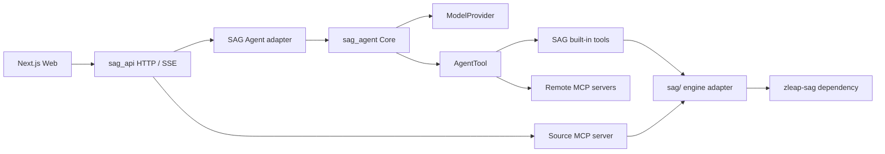

# Agent · MCP · 搜索图谱

本文只描述当前 SAG 已实现的三条能力链路：独立 Agent Core、双向 MCP 适配，
以及由检索结果生成的交互图谱。系统总览见 [架构正典](../architecture.md)，
Agent 的完整协议见 [Agent Runtime](agent-runtime.md)。

## 依赖关系



依赖只向下：`sag_agent` 不认识 FastAPI、数据库、模型供应商或知识引擎；
`zleap-sag` 只允许出现在 `sag_api/sag/` 适配层。

## Agent Core

- `apps/api/sag_agent/` 提供 `Agent`、`AgentRuntime`、`RunHandle`、版本化事件、
  工具审批/超时/取消和 `RunStore`。
- `sag_api/generation/llm.py` 实现模型端口；每轮只有一次 `stream_turn` 请求，
  文本 delta 与原生 function calling 共用一条流。
- `sag_api/services/agent_service.py` 将信源、SAG 工具和远端 MCP 工具适配进 Core，
  并在成功终态前持久化消息与引用。
- FastAPI lifespan 只启动一个进程级 runtime；HTTP 请求只创建 run。
- SSE 直接透传 Core 的 `run/turn/message/tool` 事件，不维护第二套 token/done 状态机。

## MCP 双向适配

### SAG 作为 MCP server

`sag_api/mcp/` 将一个信源暴露为 Streamable HTTP MCP 端点。请求通过
`source_id` 和 JWT 确定作用域，工具直接复用暖 `EngineManager`。当前工具包括：

- `search`、`get_entity`、`get_chunk`
- `list_documents`、`outline`、`grep`、`read`

同一实例只有一份 FastMCP 定义，信源作用域由 `contextvar` 注入，避免为每个信源
创建 server 或重复预热引擎。

### SAG Agent 作为 MCP client

`sag_api/tools/mcp.py` 支持 stdio 与 Streamable HTTP。连接建立后先 `list_tools()`，
再把远端工具映射为宿主 `Tool`，最终适配为 Core 的 `AgentTool`。本地名使用
`mcp__<server>__<tool>` 命名空间，连接生命周期限定在当前 run 内；单个 server
连接失败只跳过该 server，不阻断其余工具。

## 搜索图谱

`apps/web/components/features/search-graph.tsx` 是检索结果的关系投影，不是第二套
持久化知识图谱。数据来自搜索结果和每个命中信源的实体列表，形成：

```text
查询 -> 信源 -> 命中片段 -> 片段中实际出现的实体
```

- 支持辐射、层级和力导三种确定性布局；力导布局以辐射布局为种子并固定迭代。
- 一个信源最多展示 8 个去重片段、24 个候选实体；每个片段最多连接 3 个实体。
- 点击片段统一打开原文详情，列表与图谱保持同一溯源入口。
- 图谱只表达本次检索关系，不写回数据库，也不冒充引擎中的事件-实体事实图谱。

## 架构约束

1. 通用编排只能进入 `sag_agent`；知识库、HTTP、数据库和供应商逻辑留在宿主。
2. 内置工具和远端 MCP 工具必须经过同一 `AgentTool` 契约与事件协议。
3. 每个 run 必须产生且只产生一个完成、失败或取消终态。
4. MCP server 与应用内工具必须复用同一引擎适配层，避免同源不同解。
5. 搜索图谱的节点必须可回到原始搜索结果，不能生成无法溯源的内容。

## 验证入口

```bash
cd apps/api
ruff check sag_api/ sag_agent/ tests/
python -m pytest -q

cd ../web
npm run typecheck
npm run build
```
