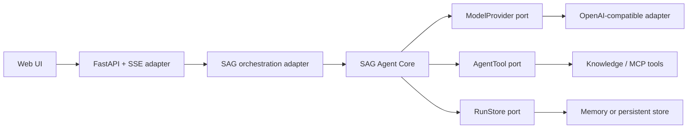
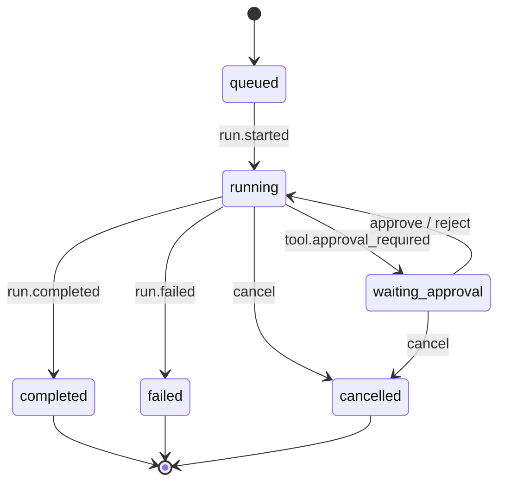

# Agent Runtime 架构

本文是当前 Agent 模块的架构正典。核心位于 `apps/api/sag_agent`，与 `sag_api`
平级。它是 extract-ready 的内部 Python 包，不依赖 FastAPI 应用源码，当前随
`sag-api` 一起安装，不单独发布到 PyPI。

## 设计目标

- 核心可单独测试，并可在需要时抽离为独立仓库/发行包。
- 模型、工具、存储和传输都通过 port/adapter 接入。
- 同一轮只发起一次模型请求，文本与工具调用共享一个流。
- 每个已接受的 run 都有且仅有一个终态。
- 取消、工具审批、并行执行、事件重放和用量统计是一等能力。
- HTTP、SSE、数据库、鉴权、会话和业务工具留在宿主，不污染 SDK。

## 依赖边界



`sag_agent` 的核心模块禁止导入 `fastapi`、`sqlalchemy`、`openai`、`sag_api`。
Core 运行时依赖为零；供应商 SDK 由宿主 adapter 负责。

## 公共 API

| 概念 | 职责 |
|---|---|
| `Agent` | 不可变定义：名称、指令、模型、工具和 run 策略 |
| `AgentRuntime` | 进程级生命周期、并发 run、监听器和共享存储 |
| `RunHandle` | 单次执行：事件流、结果、取消、允许/拒绝工具 |
| `ModelProvider` | 一轮模型流 `stream_turn(request, cancellation)` |
| `AgentTool` | JSON Schema、风险、审批、超时和执行器 |
| `ToolContext` | `run_id`、`tool_call_id`、宿主数据、取消与进度上报 |
| `RunStore` | run 事件与结果的持久化/重放端口 |

标准服务生命周期：

```python
from sag_agent import Agent, AgentRuntime, RuntimeConfig

runtime = AgentRuntime(RuntimeConfig(max_turns=6))
await runtime.start()

agent = Agent(name="assistant", model=model, tools=(search_tool,))
run = runtime.run(agent, "问题", context=request_scope)

async for event in run:
    publish(event.to_dict())

result = await run.result()
await runtime.stop()
```

应用启动时创建一个 runtime，应用关闭时停止。HTTP 请求不得自行创建长期单例。
脚本场景可使用 `async with AgentRuntime()`。

## Run 状态机



核心不变量：

1. `sequence` 在每个 run 内严格递增。
2. 终态只能是 `run.completed`、`run.failed`、`run.cancelled` 之一。
3. 审批等待器先注册，再发布审批事件，立即响应不会丢失。
4. 工具失败转成结构化 tool message 返回模型，不伪装成成功。
5. 用户取消同时触发协作式 cancellation token 和 task 取消。
6. store/listener 异常不得让 `RunHandle.result()` 永久悬挂。

## 事件协议

所有事件都带：

```json
{
  "version": 1,
  "type": "message.delta",
  "run_id": "...",
  "sequence": 4,
  "timestamp": "...",
  "turn": 1,
  "payload": {"role": "assistant", "delta": "..."}
}
```

事件分为 run、turn、message、tool 四组。宿主传输层直接使用 `type` 作为 SSE event
名称，不再维护第二套 `status/token/done` 协议。SAG 只在 `run.started` /
`run.completed` 的 payload 中附加引用、消息 ID 和 prompt 预览。

run 创建前的认证、参数或配置错误使用标准 HTTP 错误；run 创建后的失败必须通过
`run.failed` 或 `run.cancelled` 收尾。客户端若在 EOF 前未收到终态，应判定为协议中断。

## 工具与审批

工具执行器只有两个参数：

```python
async def execute(arguments, context):
    context.cancellation.raise_if_cancelled()
    await context.progress("正在查询", {"percent": 50})
    return ToolResult(content="结果")
```

默认批次并行执行；工具可声明 `execution_mode=SEQUENTIAL`。每个工具可设置独立超时、
validator、风险级别和 `requires_approval`。审批事件发出后，宿主调用
`run.approve(tool_call_id)` 或 `run.reject(tool_call_id, reason)`。

## SAG 宿主适配

- `generation/llm.py`：实现 `ModelProvider`，聚合 OpenAI 流式 tool-call delta。
- `services/agent_service.py`：解析信源/MCP，将业务工具适配为 `AgentTool`，持久化答案。
- `main.py`：在 FastAPI lifespan 启动/停止唯一 runtime。
- `api/v1/agents.py`：SSE 传输与 cancel/approve/reject 控制面。
- `apps/web/lib/sse.ts`：校验版本化事件并要求唯一终态。

应用数据库保存 thread/message；SDK 的 `RunStore` 保存执行事件与结果。这两个职责不合并。
默认 `MemoryRunStore(max_runs=1000)` 只适合单进程和测试；需要断线续传或跨实例控制时，
实现数据库/Redis store，并保持 sequence 与终态不变量。

## 独立边界门禁

```bash
cd apps/api
ruff check sag_agent/ tests/test_agent_runtime.py
python -m pytest -q tests/test_agent_runtime.py
```

当前不上传 PyPI，也不维护单独的发布或安装流水线。`sag-api` wheel 同时包含
`sag_api` 与 `sag_agent`，所以现有 `pip install -e ".[dev]"` 和启动命令不变。
未来抽离时只需移动 `sag_agent/` 与 `test_agent_runtime.py`，补一个独立
`pyproject.toml`；SAG adapter 的导入和调用无需改写。

## 架构参考

- [pi agent core](https://github.com/earendil-works/pi/tree/main/packages/agent)：低层 loop、状态化 Agent、统一事件与工具执行。
- [OpenAI Agents SDK](https://openai.github.io/openai-agents-python/running_agents/)：Runner、streamed run、生命周期与 session 边界。
- [LangGraph persistence](https://docs.langchain.com/oss/javascript/langgraph/persistence)：checkpoint/thread 持久化和恢复语义。

本实现吸收这些分层思想，但保持自己的最小边界：SDK 负责编排，宿主负责供应商与业务。
