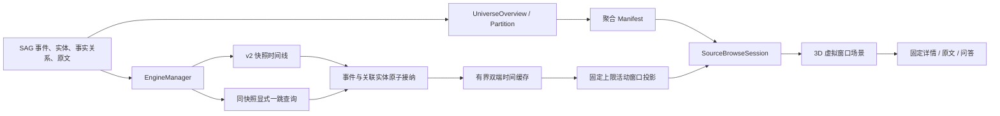

# 知识宇宙：3D 虚拟时间窗生产架构

知识宇宙是 SAG 事实库的有界 3D 探索视图。它不维护第二份知识内容，不一次性下载全库图，
也不依赖持续运行的力模拟。服务端按稳定快照双向分页返回“事件及其关联实体”；浏览器把
有界原始缓存与当前可见时间窗分开维护，像 DOM 长列表虚拟化一样只渲染配置上限内的内容。
已浏览和预取的数据可以留在缓存，但不会自动进入画面；长时间探索的 CPU、GPU 与内存成本
不会随服务端数据总量增长。

## 设计目标

1. **准确**：节点和关系只来自事实库；游标、快照和事件包必须互相一致。
2. **稳定**：活动窗步进只走确定性插值路径；预取、点击和元数据变化不会重排或刷新全图。
3. **有界**：请求、节点、关系、标签、来源轮廓和动画都有硬上限。
4. **跟手**：悬停只更新本地材质和详情，不刷新全图、不访问网络。
5. **可恢复**：迟到响应、来源切换、快照变化、容量不足和 WebGL 故障都有明确处理。

本版本只有一套生产协议和一套时间窗模型。时间线只返回 `schema_version: 2` 的原子事件结构；
前端偏好只读取 v5 存储键，不迁移旧结构。

## 产品语义

- 信息源是星系轮廓，位置来自可重建的聚合快照。
- 事件是时间主干，默认以暖色星点呈现；实体是连接事件的语义枢纽。
- 进入信息源时先加载最近一页时间。一个事件、首屏实体投影及其事实关系在数据层原子接纳，
  但产品界面只称为“事件”或“时间”，不暴露内部 bundle 术语。
- 悬停事件或实体只高亮当前真实一跳网络；无关节点和关系变浅。移开后恢复默认。
- 单击事件或实体只锁定/解锁同一高亮状态，不移动镜头，不发请求。
- 只有详情区的“探索更多”会调用邻域查询并追加一个显式探索包。
- 滚轮始终只做平滑缩放，拖动始终只做相机旋转/平移；两者不触发时间加载，不存在景深门、
  阈值或隐式翻页。直接操作相机会把时间预览恢复成稳定的正常模式。
- 时间前进和回退只由底部明确按钮触发。一次点击切换一整个可见时间页：默认 6 个事件共同
  进入同一条动画时间线，不逐个弹出；时间远近由深度、尺寸和透明度表达。
- 正常模式平铺当前时间窗，节点等比、连接稳定；预览模式按时间远近呈现近大远小。首次翻页
  进入预览，反向回到预览原点时恢复正常；任意相机拖动或缩放也立即恢复正常。
- 进入来源后预加载相邻时间页；接近任一缓存低水位时按最近探索方向补齐较早或较近一侧。
  窗口切换优先读取缓存，只有目标侧不足且服务端仍有数据时才等待一次网络页。
- 服务端确认较早侧没有数据且用户抵达缓存末端后进入完成态；下一页按钮禁用，但仍可回退、
  缩放、旋转、悬停和锁定当前图谱。
- 搜索和助手结果不使用时间分页；只有普通信息源浏览使用 3D 时间窗。
- 搜索命中只改变高亮和镜头取景，不重排信息源或平移既有节点。

## 数据流



事实来源只有 SAG 数据库。`UniverseOverview`、`UniversePartition` 和
`UniverseDirtySource` 是展示索引：新索引完成后再原子切换，来源变化会递增脏版本并合并
后台重建任务；删除这些索引后可以从事实库重建。

## 统一读取快照 v2 协议

`POST /api/v1/universe/timeline` 使用 `(event_time DESC, event_id DESC)` 的签名双向游标。
请求明确携带 `direction: older | newer`；根请求只能从 `older` 方向开始，之后两端分别使用
响应的 `older_cursor` 或 `newer_cursor`。首次请求返回 `snapshot_id`；所有续页必须同时携带该快照。快照绑定信息源、`as_of` 和
`source_revision`，游标不能跨来源、锚点或版本复用。`timeline` 与 `expand` 共用唯一的
`source-read-snapshot` v2 令牌；旧版本令牌直接拒绝，不做迁移或兼容。

响应顶层只包含事件包，不包含旧的扁平 `nodes` / `relations`：

```text
schema_version: 2
source_id, source_revision, snapshot_id
request_direction, request_cursor, page_id, as_of
bundles[]:
  bundle_id
  event
  nodes[]                 # 当前事件的首屏实体投影
  relations[]             # event -> returned entity，一实体一事实边
  neighbor_page:
    total_unique
    returned_unique
    complete
    next_cursor             # 首屏未覆盖的事件邻域，可直接续接 expand
  cursor_after            # 接纳到该包后才允许提交的游标
page:
  returned_bundles
  returned_unique_nodes
  returned_relations
  direction
  has_newer, newer_cursor
  has_older, older_cursor
  has_more
  next_cursor             # 请求方向对应的边缘游标
```

服务端和客户端都会验证以下条件：

- 包 ID、事件 ID和非空游标在页内唯一。
- `event.kind` 必须是 `event`；邻居必须是 `entity`；关系必须是同来源的 `mentions`。
- 每个返回实体恰好有一条从当前事件出发的事实关系，不允许悬空边或重复边。
- 邻居计数、页面计数、`complete`、双端 has/cursor、请求方向与 `next_cursor` 必须与实际载荷一致。
- 同一 `bundle_id` 的重试必须拥有完全相同的规范化载荷；内容变化会被原子拒绝。

`POST /api/v1/universe/expand` 同样返回 `schema_version: 2`、`source_revision`、
`snapshot_id`、`request_cursor`、`page_id`、`bundle_id` 和 `as_of`。浏览模式必须沿用时间线
快照；搜索或助手结果的第一次显式探索可创建新快照，续页必须携带它。客户端在修改工作集
前逐项核对请求锚点、来源、版本、时间边界、事实闭包、计数和游标前进性。

默认网络页最多返回 6 个事件，且查询页大小不随可见窗口设置缩小。一次按钮操作推进
`min(网络页大小, 当前可见上限)` 个事件：默认配置下一次切换 6 个；若用户把可见上限调成 2，
则按连续的 2 个事件切换，绝不从 `[0,1]` 跳到 `[6,7]`。末页不足一个视觉页时只在服务端已明确
到达边界后整体接纳，回退会精确落回上一个页边界。每个事件默认投影 8 个最高权重实体。超出投影的
邻域只通过显式“探索更多”分页读取。实体显式探索每页最多读取 4 个直连事件；事件显式
探索每页最多读取 8 个实体。两种载荷都必须作为一个事实闭合的小包原子接纳。

来源版本在引擎查询前后各检查一次。若事实版本变化，服务端返回
`409 snapshot_changed`；前端丢弃该来源的旧工作集和游标，绝不混合两个快照，并自动重读一次
最新根页。若新快照在重读期间再次变化，则停止自动循环并提示用户重新选择信息源。

## 双向缓存与可见时间窗

`SourceBrowseSession` 分别维护缓存列表、可见窗口和分页状态。`UniverseWorkingSet` 仍只进行
bundle 级接纳和逐出：

- `bundle_order` 按服务端分页查询顺序排列：`event_time DESC`，首批是最新事件，续页逐步走向
  更早事件。它是接纳顺序上的 FIFO，不表示时间升序。
- `timeline.deque` 以最新到最早的规范顺序保存有界原始页，两端分别维护 `newerCursor / olderCursor`
  与 `hasNewer / hasOlder`；`timeline.window` 保存当前连续可见 ID、活动索引、单调 `visitedCount`
  和单调 `queriedCount`。
- `node_owners` / `relation_owners` 为共享实体和关系维护所有者集合。
- 新包必须整体放入预算；不能放入时，输入工作集保持原样。
- 一次网络页必须整体通过协议与容量校验后才提交 deque、工作集和窗口；任何事件无法接纳时，
  当前页、游标和画面保持原样，不提交安全前缀，也不产生半页视觉切换。
- 较早页追加到尾部时只允许从较近边缘退休安全历史；较近页插入头部时只允许从较早边缘退休
  安全 future。活动事件按稳定 ID 重新锚定，不能用旧数值索引误选另一个事件。
- deque 决定退休边缘后，工作集只保护最终保留的缓存 ID，允许同一事务释放已退休边；所有最终
  保留的事件及事实端点仍必须完整驻留，否则整页拒绝。
- 显式实体/事件扩展属于可选支持包，并记录
  `origin / anchor_key / lineage_root_key / request_cursor / next_cursor`。`lineage_root_key` 继承首次进入
  分支的时间线节点，使中间扩展包离开 FIFO 后，最新连续后缀仍能准确归属当前窗口；它不制造
  新事实边。支持包只有 lineage root 属于活动窗口时才投影，属于缓存时间线时才驻留。被筛掉的
  实体不能作为画面锚点。载荷 FIFO 与分页游标相互独立：正常逐出旧页不回退已确认游标，失败、
  迟到响应或快照变化仍不得推进游标，也不能重新引入孤立网络。
- 浏览扩展保护全部时间线缓存和当前实际投影的支持后缀；时间线预取先逐出离屏扩展，再按方向
  退休 deque 的安全边缘。容量不足时拒绝扩展或暂停预取，不得以跳过任何已查询事件为代价腾出空间。
- 活动列表始终是缓存列表的连续、有序、无重复子集，长度不超过 `visibleEventBundles`。稳定
  场景从活动包和可达支持包中再按规范事件 ID 选择唯一事件槽，最终事件星总数也不得超过
  `visibleEventBundles`；数据充足时每次步进后继续保持这个上限。未锁定的时间线步进先为新的
  active 事件保留中央槽；锁定时精确保留被点中的事件和事实边。显式深挖只在画面内保留能装下的
  最新连续探索后缀，更早祖先从边缘退出并可由 resident FIFO 回收。最新探索叶子成为中央焦点，
  互不依赖的旧分支和最远边缘事件先退出，因此固定小窗口也能持续层层深入。离屏历史和 ahead 预取只占 resident 缓存，不占
  WebGL 节点、连线或卡片预算。共享事件/实体按规范 ID 只渲染一次，事实边只在两端均投影时显示。
- 共享节点只有在最后一个所有者包离开后才删除。
- 锁定节点及其当前真实一跳网络的节点和事实边都使用持久 pin；本次事务保护与持久 pin
  分离，解锁时一起释放。
- 降低预算不会拆开受保护事件包，也不会制造悬空边。

缓存接纳与场景渲染使用两层独立硬预算。resident 预算约束浏览会话中的驻留时间线载荷；
进入 Three.js 前再次按 scene 预算投影。服务端 bundle 在接纳、缓存和游标层始终原子；实体扩展
页可能包含多个事件，因此视觉层按“事件 + 当前可用事实端点”拆成规范事件槽，并轮询分配关系
预算；每个事件最多投影服务端 `event_entity_limit` 条事实关系，锁定关系最先保留，避免一个深扩展
吃完预算后留下裸星，也让退场余量具备确定上界。投影预算还为最多 4 个新扩展事件（或一次时间线步进）
保留退场 headroom；低策略预算会自动降低有效窗口，而不是静默丢包或截断 ghost。
搜索和助手没有虚拟时间窗，始终直接使用 scene 预算：

| 设备 | 可见事件默认 / 上限 | 缓存容量默认 / 上限 | scene 节点 / 关系 | resident 节点 / 关系 | 来源轮廓 |
|---|---:|---:|---:|---:|---:|
| 桌面 | 6 / 18 | 24 / 96 | 240 / 360 | 1152 / 1152 | 160 |
| 移动 | 6 / 8 | 24 / 36 | 120 / 180 | 480 / 480 | 64 |

用户配置的可见时间上限范围为 2–18，默认 6；缓存容量范围为 12–96，默认 24。默认容量按
“可见窗口 + 1 个较近历史页 + 2 个较早预取页”计算，移动端应用 8/36 的设备有效上限。缓存容量
只是保留上限，不是首屏填满目标；正常状态在任一方向低于一页安全水位时只预取一个相邻网络页，
并优先最近操作方向，避免来回振荡。把容量调到 96 不会在进入来源时连续拉满网络。

`queriedCount` 记录本次来源会话曾确认的最深查询高水位；向较近方向回载并从另一端退休数据时
也不会倒退。实体数显示当前有界工作集中的驻留实体，不维护随全来源增长的 ID 账本。时间轴遍历
完成不等于全量节点同时驻留。
运行中降低缓存上限或从桌面切到移动端时，不会丢弃游标已经跨过但用户尚未浏览的事件包：
客户端会停止预取，并围绕当前活动事件按稳定身份裁剪两端，保留可见窗口和至少一页回退余量。
收敛期间仍受此前的全局最大 resident 预算约束；这比立即截断并永久跳过事件更重要。
探索态右上角在退出按钮左侧提供快速设置入口：桌面使用 420px 右抽屉，移动端使用 82svh
底部抽屉。抽屉与完整设置页复用同一偏好状态和组件，修改立即生效并持久化，关闭后焦点返回
触发按钮；抽屉本身不触发查询或全量工作集替换，窗口配置变化只做有界重投影和增量过渡。

浏览器只保留当前来源的一个 `SourceBrowseSession`，其中缓存、窗口、`working` 与 `timeline`
同生共灭。
切换来源立即中止请求、清空扩展缓存与游标，并为目标来源创建全新会话；返回之前的来源也从
首游标重读，绝不复用可能过期的来源缓存。响应提交前还会确认 epoch、active source 和会话
对象仍然一致，因此来源切换后的迟到响应无法污染当前图。

## 3D 场景与增量过渡

3D 用于表达深度、来源层级、入场方向和镜头取景，不使用持续漂移制造“灵动感”。

- OrbitControls 独占相机输入：滚轮平滑缩放到安全最小/最大距离，拖动旋转或平移，启用 damping
  与 zoom-to-cursor。相机输入永远不调用时间 API，也不进入时间意图队列。
- 正常模式使用确定性的平面散点布局，所有节点等比并保持稳定事实连接；预览模式使用连续时间
  曲线把当前页映射成近大远小的 3D 深度、尺寸、卡片比例、节点透明度和关系透明度。
- 一次按钮切页只有一个窗口 revision 和一个共享 `startedAt`。同页事件及其实体同时开始插值，
  时间顺序由目标深度与比例表达，不使用逐节点延迟，因此不会出现一个个弹出或中间空白帧。
- 每个活动窗切换按稳定节点/关系 ID 计算 `retained / entering / exiting`：保留对象从当前实际
  坐标插值到新坐标，绝不归零；新对象只从中央小星点长入；真正失去全部 owner 的对象作为
  ghost 向外缩小淡出，动画结束后才释放。共享实体和卡片 DOM 只要仍被引用就复用原对象。
- 相同场景签名复用同一个数据对象；phase、统计、相同窗口 settle 和预取不触发可见拓扑变化。
  像素比只有在设备/负载档位真实变化时更新；卡片用 keyed reconcile，不整体删除重建。
- 过渡期间前进/后退按钮禁用。新页完成协议校验和原子接纳前，当前图谱、游标和连线保持可见；
  失败时无需“恢复整图”，因为场景从未先行退场。
- 活动事件使用连续 age 曲线向两侧展开。向较早时间前进时新页从中央长入、旧页从外缘离开；
  向较近时间回退时缓存页从外缘返回、当前页收回。两种方向都从当前插值位置继续，不跳回
  起点；稳定态始终只有一个配置上限内的活动窗口。
- 初始进入与双侧缓存低水位允许后台预取一页；窗口切换命中缓存时不等待网络。只有目标侧不足、
  对应 `hasOlder/hasNewer=true`、当前来源会话仍有效且没有锁定节点时，按钮操作才等待一次请求。
  预取和前台补页共用同一个 in-flight 请求，不能并发或越过安全游标。后台预取失败只保留诊断，
  不覆盖用户当前提示，也不扰动可见图谱。
- 信息源使用 manifest 的稳定坐标；搜索不会改写坐标。
- 已有节点的 `x/y/z` 与 `fx/fy/fz` 始终一致，数据更新后也不参与重新布局。
- 新节点按 `source -> root -> kind -> id` 的稳定顺序放置，优先继承已放置关系邻居的局部
  偏移，并使用最多 48 次的确定性障碍探测减少重叠。
- 最近 512 个节点的确定性目标位置有界记忆；筛选隐藏后重新显示不会跳到新位置。
- 新节点可以沿固定曲线入场；正常完成、低动态模式或锁定中断最终都会落在同一个目标点。
  入场每帧同时同步数据坐标、WebGL 节点和关系几何，标签、星点和连线不得出现坐标脱节。
- 底层 force graph 只同步图对象，`warmupTicks=0`、`cooldownTicks=1`，不负责持续布局。
- 预算内事实关系默认全部以无粒子、三棱低面数的背景细线显示；宽度按引擎真实的 0.1
  量化精度使用 0.2 / 0.1 两档，暗色默认透明度从 0.28 降到 0.09。默认关系启用深度测试并处于渲染层 0；
  一跳高亮关系才临时置于层 1。材质常驻，悬停/锁定只更新材质并淡化其他关系，不隐藏事实网络，
  不改变线宽，也不调用全图刷新。
- 事件与实体常驻卡片开关默认都开启，但实际卡片数量仍受视口预算和碰撞回填约束；事件无论
  是否获得卡片都保持星点。关闭任一卡片开关后，悬停或锁定仍会强制显示焦点及其真实一跳网络
  卡片，移开后恢复。事件星使用清晰核心与柔光双层纹理并保持最小屏幕尺寸；根事件使用浅 Z
  稳定分布，详情态来源光核与星云退场。事件星使用渲染层 3/4；每个实体都使用渲染层 2 的
  柔光与清晰核心双层图元，并拥有独立命中区和最小屏幕尺寸。实体标签受视口预算限制并避让事件星；
  标签受限不等于实体图元被隐藏。
- 卡片总量按视口面积自动计算且最多 20 个；事件卡片和实体卡片可分别关闭，但开关只控制
  卡片资格，不隐藏事件星、实体图元、事实关系、hover 命中或键盘导航。标签采用三倍候选池
  碰撞回填，并避让摘要区、进度区、详情区、事件星和工作台。
- 节点材质归图引擎释放；共享星点纹理、Sprite 四边形和命中几何由场景统一持有。FIFO 移除节点前
  必须解除共享引用，销毁场景时再统一释放，避免长期滚动中的重复释放与 GPU 重新上传。
- 节点不可拖拽。锁定、解锁和窗口 resize 都不会自动移动镜头或重新加热图。
- 星云和入场动画有明确结束时间；场景稳定后暂停 RAF 与 WebGL 渲染。
- 画布只有一个键盘焦点；方向键按稳定空间顺序游走，Enter/Space 锁定，Escape 清除。
- 星云粒子另设硬上限：桌面 3000、移动 1200；这与事实节点预算相互独立。

运行时会暴露节点数、边数、像素比、布局稳定状态、冻结节点数、放置数量和放置耗时等
dataset 诊断字段。WebGL context loss 或渲染引擎加载失败必须进入可理解的降级视图，不能
留下空白画布。

## 交互状态

| 输入 | 本地高亮 | 锁定 | 镜头 | 网络请求 | 修改工作集 |
|---|---|---|---|---|---|
| hover 节点 | 一跳 | 否 | 否 | 否 | 否 |
| click 节点 | 一跳 | 切换 | 否 | 否 | 仅 pin 一跳节点与事实边 |
| 详情“探索更多” | 保持 | 保持 | 否 | 是 | 原子追加包 |
| click 信息源 | 来源 | 否 | 聚焦来源 | 最近时间线 | 新建当前 source 会话 |
| 滚轮 | 保持 | 保持 | 平滑缩放并恢复正常模式 | 否 | 否 |
| 拖动 | 保持 | 保持 | 旋转/平移并恢复正常模式 | 否 | 否 |
| 下一段时间按钮 | 保持 | 否 | 页级中央长入 / 外缘淡出 | 缓存不足时至多一页 | 固定上限时间窗前进 |
| 上一段时间按钮 | 保持 | 否 | 页级外缘返回 / 中央收回 | 较近缓存已退休时至多一页 | 固定上限时间窗后退 |
| 已到时间线末尾后点击下一页 | 保持 | 否 | 保持 | 否 | 否 |
| 搜索 / 助手结果 | 命中网络 | 否 | 聚焦命中 | 否 | 新 epoch 替换 |

时间窗分页在节点锁定期间被禁止提交。网络失败保留当前安全游标与旧窗口以便重试；容量不足
则停在最后一个已确认页，不会用缓存尾部的零散事件伪造一次翻页。只有服务端明确报告目标侧
结束时才允许不足一页的末页切换。完成态只能由当前快照较早侧的 `hasOlder=false` 且用户抵达
末端共同触发；当前驻留数量不能推断时间线是否完成。

## 生产验证门禁

- 时间线 v2 无扁平旧字段；续页缺少 `snapshot_id` 必须返回 422。
- 同一快照的根页重试产生相同 `page_id` 和事件包；从任意包游标恢复时无重复、无遗漏。
- 来源版本变化返回 409，客户端清空旧 source 会话，不混合载荷。
- timeline/expand 必须共享同一 v2 快照；旧令牌、跨锚点游标、无进展游标和响应时间边界变化
  都必须在工作集修改前拒绝。
- 任意接纳序列都不超过 resident 设备预算；任意场景投影都不超过 scene 设备预算。两层都不拆
  事件包、不产生悬空边，所有者集合无重复。桌面 96 包与移动 36 包的最密集 8 实体事件包必须
  可驻留，而额外多页支持包仍不能使场景超过 240/360 或 120/180。
- 固定缓存满后，较早页只能退休较近安全边，较近页只能退休较早安全边；active 身份、可见时间窗、
  双端游标和单调查询高水位必须在往返加载后保持一致。
- 相同 bundle ID 的不同节点或关系载荷必须拒绝，完全相同重试必须幂等。
- hover、click、滚轮和拖动不触发 API；只有明确来源入口、双侧低水位预取、底部页按钮缓存未命中
  和详情“探索更多”可以查询。
- 可见窗口设为 2 时网络请求仍可一次读取 6 个事件，但按钮按 `[0,1] -> [2,3] -> [4,5]` 连续推进，
  不遗漏中间事件；缓存容量设为 96 时首屏仍只填充水位，不以容量上限为目标连续拉满网络。
- 默认窗口一次切换 6 个事件；同页所有事件与实体共用一个动画起点，按时间深度近大远小，禁止
  逐节点 start delay。过渡期间按钮禁用，不会并发请求或跨越缓存顺序。
- `[a,b,c] -> [b,c,d]` 只允许失去 owner 的节点退出、只允许新节点进入；重叠节点、关系、
  Object3D 和标签 DOM 身份保持。phase-only 与 settle 不调用 `graphData()` 或重设像素比。
- 前进多轮再回退时，缓存内容不因回退重复请求；每个稳定帧只投影连续活动窗及其可选支持包，
  活动事件数永不超过配置上限。离屏缓存不得生成 WebGL 节点、事实边或卡片。
- 可见包 ID 始终是缓存包 ID 的连续有序子集；缓存命中切换不访问 API。稳定会话中的缓存和
  可见数量不超过设备有效上限；运行中降低上限时停止预取并安全收敛，期间不超过全局 96 包
  硬上限，也不丢失尚未访问的事件。
- 新页失败、迟到或快照不匹配时，当前窗口和安全游标都不改变；服务端返回末页且用户抵达末端后，
  下一页按钮禁用且不再请求，滚轮仍保持正常缩放。
- 非活动窗步进时，已显示节点在预取、筛选、hover、锁定、resize 和搜索高亮后世界坐标不变；
  活动窗前后移动时只有 retained 节点沿确定性目标平滑插值。
- 锁定一跳网络的节点和事实边在容量淘汰中一起保留；解锁后恢复正常 FIFO。
- 事件始终保留星点，两类常驻卡片默认开启；显式关闭后 hover 仍显示焦点卡片，离开后临时
  卡片和一跳强调都恢复。
- 稳定场景进入休眠；页面隐藏、交互关闭或 WebGL 故障立即停止渲染。
- 离线或请求失败时保持当前窗口，并提供可重试状态，不以空白窗口替代已有内容。
- 中英文消息键一致，TypeScript、ESLint、Ruff、前后端图谱测试和 diff check 全部通过。

## 扩展约束

- 新的数据查询过滤条件必须进入签名游标或快照身份，不能只在前端过滤；实体类型属于已接纳
  事实包的显示投影，只可隐藏实体及其 `mentions`，不能删除事件、`subevent` 或推进游标。
- 新节点类型必须先定义事实方向、事件包边界、排序和分页协议，再增加视觉样式。
- 聚类只能作为低缩放聚合层，不能替代事实节点和关系。
- 搜索激活复用既有证据，只高亮和取景，不为动画重复检索或移动图。
- 任何提高预算的变更必须先提供目标设备上的放置耗时、帧时间、显存和 context-loss 数据。
