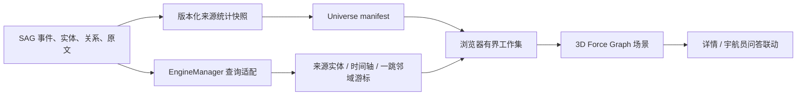

# 知识宇宙架构

知识宇宙是现有 SAG 事实库之上的渐进式探索界面。它不维护第二份知识内容，也不把
全库图发送到浏览器；服务端只提供来源统计、稳定游标和一跳邻域，浏览器维护一个有界
工作集并用 3D 场景呈现。

## 产品语义

- 信息源是星系，只显示聚合规模和稳定位置。
- 实体是进入星系后的主题星点，按最近被事件提及的时间逐页显现。
- 悬停实体/事件只高亮已加载的一跳关系，并在固定详情区提示剩余关联，不发起查询。
- 点击“探索更多”才查询并提交下一页；被点击的事件会成为唯一镜头与布局锚点。
- 同一节点可重复点击，按稳定游标持续向更早事件或更低权重实体推进，直到完整呈现。
- 拉近信息源按事件时间逐页追加“事件 + 有界高权重实体”，每个显式缩放手势都可继续推进。
- 已加载关系始终以极细、低透明度底线存在；悬停或选中只提高当前一跳关系的层级。
- 已具现的实体和事件在同一节点卡片内直接显示来源、标题与摘要，不再叠加摘要浮层。
- 新搜索开启新 `epoch` 并替换工作集；手动探索只增量合并，不清空路径。
- 查看详情与向宇航员提问是节点的显式二级操作，节点单击只负责聚焦和展开。

## 数据边界

事实来源只有 SAG 数据库。应用数据库中的 `UniverseOverview`、
`UniversePartition` 和 `UniverseDirtySource` 是可重建的展示缓存：

- 新快照构建完成前，旧快照继续服务。
- 完整构建提交后才原子切换 `is_active`。
- 文档或来源变化只标记脏来源，并合并后台刷新任务。
- 老版本本地缓存保留 `seed` 与 `time_range` 兼容字段，升级不要求删库。

## 查询协议

### 来源到实体

`POST /api/v1/universe/activate` 使用 `(activity_time DESC, entity_id DESC)`
复合游标。`activity_time` 是实体关联事件的最大有效时间，服务端同时返回准确的
`related_count`。游标签名绑定来源、类别、时间窗和 `as_of`，不能跨查询复用或篡改。

### 双向邻域

`POST /api/v1/universe/expand` 只读取一个锚点的一跳：

| 锚点 | 返回顺序 | 游标 |
|---|---|---|
| 实体 | 关联事件按有效时间、权重、ID 降序 | 时间 + 权重 + ID |
| 事件 | 关联实体按权重、ID 排序 | 权重 + ID |

接口返回锚点元数据、准确度数、当前页节点、事实关系和下一页游标。详情接口单独读取
原文证据，邻域查询不复制或伪造文档片段。

### 来源时间轴

`POST /api/v1/universe/timeline` 使用 `(event_time DESC, event_id DESC)` 游标，
每页只返回配置数量的事件，并为每个事件附带最多
`timeline_entities_per_event` 个高权重实体。事件和实体都来自现有事实表，关系按事件分页
同步返回。继续拉近会读取下一页，不受初始实体自动显现页数限制；浏览器节点/边预算仍是
最终硬边界。

## 前端运行时

- `WorkspaceRuntime`：`hidden | mini | normal` 工作台形态。
- `PetRuntime`：宇航员动作、形态和专属配置。
- `ConversationRuntime`：主面板和迷你问答共享会话。
- `UniverseWorkingSet`：当前 `epoch` 的节点、关系、根节点和访问时间。
- `UniverseScene`：镜头、单事件锚点、LOD、拖动、标签、邻接高亮和渲染休眠。

工作集合并遵守以下不变量：

1. 旧 `epoch` 的迟到响应直接丢弃。
2. 来源实体页作为根节点，在预算裁剪时优先保留。
3. 当前锚点和最近访问节点优先保留，边只能引用仍在工作集中的节点。
4. 桌面最多 2,000 节点 / 5,000 边；移动端最多 800 / 1,500。
5. 深层缩放每个独立手势最多追加一页，避免滚轮一次触发多次查询。
6. 悬停只读取浏览器工作集，不访问邻域接口，也不修改 `workingRef`。
7. 点击才请求下一页；重置、新搜索或组件卸载会取消尚未完成的拓展请求。
8. 新邻居从当前实时锚点附近生成；同一时刻最多一个事件被锁定，点击其他事件会替换锚点。

## 场景与交互

场景使用 `3d-force-graph`，来源位置来自稳定快照，具象节点使用来源内稳定散布位置。
实体为冰蓝晶核星点，事件为暖黄色星芒，不使用高饱和同心圆。标签数量有上限，并按
右、左、下、上的顺序寻找空位，避让其他标签与工作台。事实关系使用低透明度一像素级
底线保留整体结构；悬停或选中时只突出一跳邻域，并降低无关节点与关系的视觉权重。
悬停不改变节点卡片尺寸，固定左下角详情区显示当前节点摘要、已提交/总关联数；仅在
仍有下一页时显示“探索更多”。点击事件后先锁定它的实时世界坐标并移动镜头，新邻居再从
该坐标附近生长，避免力导布局在增量合并时把探索中心推走。

渲染生命周期是事件驱动的：数据、镜头、拖动或指针交互唤醒动画；稳定后暂停 WebGL
动画和标签循环。粒子预算与像素比随设备和节点数量下降，页面隐藏时立即暂停。

节点详情区提供三个稳定命令：确认并继续探索、查看详情、向宇航员提问。问答事件只预填
可编辑问题，不自动发送；用户仍可添加 `@` 范围、附件和工具，能力与完整问答一致。

## 扩展规则

- 新的时间过滤必须进入游标签名，不能只在前端过滤。
- 新节点类型必须先定义事实关系方向、排序和分页协议，再增加视觉样式。
- 主题社区只能作为低缩放聚合层，不得替代事实节点或关系。
- 搜索激活必须复用搜索返回的证据，不得为动画重复执行检索。
- 任何全库能力都必须先给出服务端预算与视口/游标边界，禁止一次性返回全图。

## 验证门禁

- 删除展示缓存后可从现有事实库重建。
- 来源实体分页无重复、无遗漏，游标不能跨来源或时间窗使用。
- 来源时间轴从新到旧稳定分页，同一事件不跨页重复，每个事件的实体数量受服务端上限约束。
- 实体和事件双向展开的度数、节点和关系一致。
- 场景稳定后进入休眠，移动端自动使用更低代理粒子和节点预算。
- 桌面和移动端画布非空，标签、工作台、宇航员和操作条不重叠。
- 无锚点时关系底线存在且不抢视野；悬停或选中时仅邻接关系提亮。
- 新展开的一跳邻居优先获得摘要卡片，不能被来源实体页的标签预算挤出。
- 悬停卡片尺寸不变化且不产生邻域请求；点击后才持久追加节点、关系并推进游标。
- 点击事件后，事件 ID、镜头中心和布局锚点保持一致；追加邻居不会改变锚点世界坐标。
- 查看详情和宇航员问答不改变事实工作集；只有新搜索重置 `epoch`。
