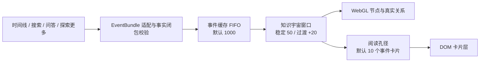

# 4D 知识宇宙：生产实现

知识宇宙是 SAG 事实库的有界 4D 探索投影。三维空间表达关系与纵深，时间或文档叙事顺序表达演进。
它不复制知识内容、不一次性下载全库图，也不通过持续力模拟制造动态效果。

当前实现只有：

- 一套事件—实体事实模型；
- 一套 `UniverseSceneEngine` 与对象资源；
- 一套 v6 用户配置；
- 两种明确、互斥的工作状态。

## 1. 产品状态

```text
知识宇宙主页
  └─ 选择信息源
      └─ 信息源探索会话
          ├─ 时空探索态 exploration
          └─ 线索累积态 accumulation
```

### 1.1 时空探索态

时空探索态只浏览一个信息源快照。事件按服务端给出的稳定时间或叙事序列排列，滚轮推动相机沿
该序列飞行：

```text
信息源星云 → 远处粒子 → 事件星 → 完整卡片 → 边缘淡出
```

- 向前滚动深入时间，向后滚动沿同一路径回退。
- 前后页预取只写事件缓存，不直接刷新场景。
- 可见窗口按连续事件增量移动；旧事件在边缘退出，新事件从远端中心进入。
- 到达时间起点后继续回退，先还原信息源星云，再回到知识宇宙主页。
- 底部上一段、下一段和自动播放是精确导航兜底，不改变滚轮语义。

### 1.2 线索累积态

搜索、问答和“探索更多”是线索来源，不是第三种场景模式。它们返回的事实统一进入线索累积态：

- 每批结果先按稳定事件、实体和关系 ID 去重；
- 新线索增量加入同一临时关系图；
- 未退出窗口的旧节点保持世界坐标；
- 多轮问答持续累积，并显示轮次和当前事实规模；
- 累积态不执行时间线预取；
- 窗口满后按事件进入顺序 FIFO 退出最旧线索；
- 返回探索时恢复进入累积态前的来源、事件窗口、时间深度、相机和焦点。

### 1.3 显式状态机

`apps/web/lib/universe-session-state.ts` 是页面状态的唯一权威：

| 动作 | 结果 |
|---|---|
| `ENTER_EXPLORATION` | 从主页进入单一信息源探索 |
| `ENTER_ACCUMULATION` | 保存探索现场并进入临时线索图谱 |
| `APPEND_EVIDENCE` | 在累积态追加一批去重事实 |
| `RETURN_TO_EXPLORATION` | 恢复完整探索现场；没有快照时回主页 |
| `TOGGLE_LOCK` | 锁定或再次点击解除锁定 |
| `CLEAR_FOCUS` | 只清除焦点、锁定和详情，不刷新数据 |
| `GO_HOME` | 销毁当前会话并回到知识宇宙主页 |

搜索、问答或浏览来源不能根据 `origin` 隐式切换展示策略。状态变化只能通过上述动作发生。

## 2. 输入与交互契约

| 输入 | 时空探索态 | 线索累积态 |
|---|---|---|
| 普通滚轮 | 沿时间轴推进/回退 | 标准空间缩放 |
| Ctrl/Cmd + 滚轮或 pinch | 空间缩放 | 空间缩放 |
| 拖动 | 环视/平移并刹停时间惯性 | 环视/平移 |
| hover 事件/实体 | 本地高亮完整一跳网络 | 同左 |
| 点击事件/实体 | 锁定；再次点击解除 | 同左 |
| 点击空白 | 只解锁、关闭详情 | 同左 |
| 自动播放 | 显式开启后推进时间 | 不提供 |

交互不变量：

1. hover、锁定和解锁不发网络请求。
2. 点击空白不重载窗口、不重置相机、不改变状态。
3. 事件和实体节点始终一起参与事实网络；卡片开关只改变 DOM 阅读层。
4. 焦点接管阅读孔径时，完整显示安全上限内的一跳端点；不能出现亮线却没有可读端点。
5. AI 问答和探索更多开始时自动释放原锁定，让新增线索拥有视觉焦点。

## 3. 数据分层



网络分页、纯数据缓存、场景窗口和卡片预览是四个独立概念：

- 分页 20 不等于一次替换 20 个场景节点；
- 缓存 1000 不等于创建 1000 个 Three.js 对象；
- 窗口 50 不等于显示 50 张卡片；
- 关闭卡片不删除事件、实体和关系。

### 3.1 原子事件包

`apps/web/lib/universe-event-cache.ts` 定义唯一场景数据单元：

```ts
type UniverseEventBundle = {
  origin: "timeline" | "search" | "assistant" | "expansion";
  sourceId: string;
  event: UniverseEvent;
  entities: UniverseEntity[];
  relations: UniverseRelation[];
  ordinal?: number;
  temporalKey?: string;
  documentId?: string | null;
};
```

同一事件的实体和事实关系原子接纳。重复事件合并实体与关系，但不会再次加入 FIFO 顺序。
实体类型过滤后，被过滤实体和以它为端点的关系同时移除；事件本身仍可存在，不制造假边。

### 3.2 事件缓存

`apps/web/lib/universe-event-cache.ts` 使用 `Map + admissionOrder`：

- 默认 1000，范围 200–5000；
- 按首次接纳顺序 FIFO；
- 重复事件只合并，不改变排队位置；
- 超出容量从队首删除缓存索引；
- 不使用 LRU、热度、关系权重或桥接保护；
- 缓存淘汰不会修改已经进入场景窗口的不可变事件包引用。

### 3.3 场景窗口

`apps/web/lib/universe-scene-window.ts` 管理两个状态共享的事件窗口：

- 稳定态默认最多 50 个事件；
- 单次过渡最多额外接纳一页 20 个事件；
- `incoming / outgoing / pendingActive` 构成一个显式过渡事务；
- 过渡完成后统一提交新活动窗并回到稳定上限；
- 共享实体按活动事件引用计数，最后一个引用退出后才删除；
- 关系只在事实两端都存在时投影。

线索累积的批次大于过渡余量时进入 `pendingBundles`，按批次继续接纳，不把整批节点同帧塞入场景。

### 3.4 时序预取

`apps/web/lib/universe-prefetch-controller.ts` 只服务时空探索：

- 默认分页 20，范围 10–50；
- 当前窗口前后各预取 0–3 页，默认 3；
- 一次只允许一个请求在途；
- 优先最近探索方向，再补另一侧；
- 相同游标不重复请求；
- 来源、范围或代际变化会使迟到响应失效；
- 到达一侧边界后只补另一侧；
- 网络结果只进入缓存，场景由时间位置决定何时消费。

### 3.5 线索追加

`apps/web/lib/universe-accumulation.ts` 统一处理搜索、问答和探索更多：

- `seenBundleKeys` 保证多轮去重；
- 同事件的新实体或关系仍会合并进缓存；
- 完全重复的批次不移动相机、不重排图谱；
- 新批次按窗口过渡容量分段进入；
- 累积态没有前后游标和预取页。

## 4. 一套 v6 配置

`apps/web/lib/universe-view-preferences.ts` 不读取或迁移旧版本：

| 配置 | 默认 | 范围 | 含义 |
|---|---:|---:|---|
| `cacheCapacity` | 1000 | 200–5000 | 纯数据 FIFO |
| `eventWindowSize` | 50 | 20–100 | 稳定场景事件上限 |
| `cardsEnabled` | 开 | 开/关 | 同时控制事件与实体卡片 |
| `eventCardPreviewCount` | 10 | 0–20 | 静止时事件卡片候选上限 |
| `temporalPageSize` | 20 | 10–50 | 时序网络页 |
| `temporalPrefetchPages` | 3 | 0–3 | 前后各预取页数 |
| `entityTypes` | 全部 | 已发现类型 | 节点和关系同时过滤 |
| `documentIds` | 全部 | 稳定文档 ID | 约束时序与追加适配 |

配置归一化保证：

- 卡片预览不大于事件窗口；
- 缓存至少能容纳事件窗口和前后预取跑道；
- 空选择恢复“全部”，不会产生无意义的第二套模式；
- 两种场景状态读同一份配置。

实体卡片不占事件卡片预览数量，但受内部 24 张 DOM 安全上限和屏幕碰撞约束。
`eventCardPreviewCount` 是阅读候选上限，不保证狭小安全视区一定同时铺满；不能为了凑数覆盖
事件星、面板或其他卡片。

## 5. 阅读孔径与焦点

`apps/web/lib/universe-preview-plan.ts` 只决定哪些节点得到 DOM 卡片，不改变 WebGL 数据：

### 静止状态

1. 先按稳定时间/重要度选至多 `eventCardPreviewCount` 个事件。
2. 实体卡片只从这些事件的真实邻接关系带出。
3. 事件优先放置，实体使用剩余安全区域。
4. 屏幕碰撞、面板遮挡或深度生命周期可减少实际同时可读数量。

### hover 或锁定

1. 当前事件或实体的一跳网络接管同一个阅读孔径。
2. 焦点事件及其真实实体端点完整显示，最多受 24 张实体安全上限约束。
3. 无关节点和关系降透明度，不增加第二层卡片墙。
4. 移开恢复静止计划；点击锁定计划；再次点击或空白点击解除。

卡片的元信息、标题和摘要始终作为一个整体存在，只做整体缩放和渐显，禁止分阶段插入内容。

## 6. 渲染架构

### 6.1 单一引擎

- `knowledge-universe.tsx`：会话、请求、快照和状态协调；
- `universe-scene-contract.ts`：React 与场景的类型化命令边界；
- `universe-scene.tsx`：轻量生命周期适配；
- `universe-scene-engine.ts`：Three.js、DOM 投影、相机和对象注册；
- 纯数据算法位于 `apps/web/lib/universe-*`，不依赖 React 或 Three.js。

探索与累积是同一引擎的两种 placement/presentation 策略。切换策略时清空空间坐标记忆，
避免时间走廊坐标泄漏到累积图谱，或累积坐标污染恢复后的探索。

### 6.2 视觉层

1. **固定远景层**：稀疏背景星与光带，不跟随图谱拖动。
2. **WebGL 数据层**：信息源星云、粒子、事件星、实体星和真实关系。
3. **DOM 阅读层**：事件与必要实体卡片、动作和状态提示。

信息源星云使用偏心旋臂、椭圆盘、亮核和稀疏外缘。进入信息源复用同一批粒子，只改变粒子
呈现和相机位置，不执行破碎、爆炸或整场替换。

### 6.3 时空投影

- 事件轨迹由稳定时间序、哈希 lane 和相机深度决定；
- 新事件从镜头中心远处由粒子凝成事件星与完整卡片；
- 先出现的事件先变大，横纵位置轻微错落；
- 近大远小按“节点深度 − 相机飞行深度”实时计算；
- 越过阅读区后向外围扩散并在安全视区边缘淡出；
- 正向与回退使用同一确定性轨迹的逆过程；
- 相机只在输入期间运动，空闲时渲染器休眠。

### 6.4 累积投影

- 新节点优先靠近已有共享实体；
- 未退出窗口的旧节点不参与全局重算；
- 新批次进入后相机以短动画框入安全视区；
- 搜索/问答面板存在时，取景中心避开面板；
- 关系线保持细且克制，hover/锁定才提升对比；
- 用户拖动、缩放或锁定可立即接管相机。

策略切换即空间边界：相同事实 ID 可以复用语义身份，但不能复用另一策略的坐标记忆。

### 6.5 WebGL 安全

- 默认桌面预算：700 节点、1000 关系；
- 稳定窗口最多 50 个事件，过渡最多 70 个事件组；
- 粒子数量受像素、设备和配置硬上限约束；
- Shader 的闪烁和相位优先由现有种子属性推导，避免超过 WebGL 最低属性数；
- 画面稳定后停止逐帧渲染，hover/相机/动画再唤醒；
- 窗口外对象在退场完成后释放，不随探索页数单调增长。

## 7. API 契约

时序接口使用快照与 keyset 双向游标：

- 默认 `limit=20`，服务端接受 1–50；
- 同一会话续页绑定 `source_id + snapshot_id + source_revision`；
- 返回稳定事件序数、双向边界和事件事实闭包；
- 请求支持实体类型与文档范围；
- 迟到、跨来源或过期快照响应不能提交游标或场景；
- 不按节点发 N+1 详情请求。

时间线、搜索、问答和探索更多最终都经
`apps/web/lib/universe-event-bundle-adapter.ts` 转成 `UniverseEventBundle[]`。

## 8. 探索现场恢复

进入累积态前，`RetainedExploration` 保存：

- 信息源浏览会话与快照；
- 事件缓存/工作集和活动时间窗；
- 当前来源、分区、方向和提示；
- 扩展游标与已加载分支；
- 相机位置、观察目标、详情混合和飞行深度；
- 选中/锁定状态。

返回时恢复该快照，不请求第一页、不重建全局布局。AI 问答开始前会把快照中的锁定清空，
因此恢复的是原观察位置和窗口，而不是一个遮挡视线的旧操作卡。

## 9. 运行时不变量

1. 稳定事件数 `<= eventWindowSize`。
2. 过渡事件数 `<= eventWindowSize + temporalPageSize`。
3. 缓存记录数 `<= cacheCapacity`。
4. 事件卡片候选数 `<= eventCardPreviewCount`。
5. 焦点实体卡片数 `<= entityCardSafetyMax`。
6. 关系只在两端均存在时渲染。
7. hover/锁定不会改变窗口 revision。
8. 预取响应不会改变相机或活动窗口。
9. 完全重复线索批次不会移动既有节点。
10. 返回探索后窗口成员与飞行深度等于进入累积态前的快照。
11. 空闲场景 `data-universe-renderer="sleeping"`。
12. 策略切换后没有跨策略坐标记忆和 ghost 节点。

场景根节点通过 `data-universe-*` 暴露只读诊断，包括事件/实体/关系数量、窗口 revision、
飞行深度、卡片候选与实际数量、焦点关系、布局稳定性、渲染器休眠状态和 WebGL 预算。

## 10. 验证

提交前至少执行：

```bash
cd apps/web
npm run test:unit
npm run typecheck
npm run lint
npm run i18n:check
npm run build

cd ../api
. .venv/bin/activate
pytest -q
ruff check .
```

浏览器验收必须覆盖：

- 主页 → 信息源星云 → 粒子/星/卡片 → 回退 → 主页；
- 前进、回退、预取、50 事件 FIFO 窗口；
- hover 完整一跳、锁定、二次点击、空白解锁；
- 探索更多与两轮以上问答增量追加；
- 累积态返回后恢复相同时间窗和飞行深度；
- 搜索/问答面板下的安全取景；
- 深色/浅色、reduced motion、WebGL/Shader 控制台；
- 空闲渲染器休眠与无 ghost 节点。
