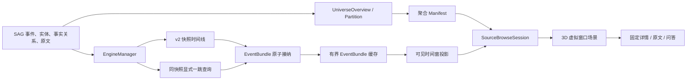

# 知识宇宙：3D 虚拟事件时间窗生产架构

知识宇宙是 SAG 事实库的有界 3D 探索视图。它不维护第二份知识内容，不一次性下载全库图，
也不依赖持续运行的力模拟。服务端按稳定快照分页返回事件包；浏览器把有界事件包缓存与
可见时间窗分开维护，像 DOM 长列表虚拟化一样只渲染当前窗口。已有节点在同一窗口内保持
稳定，长时间探索的 CPU、GPU 与内存成本不会随已浏览总量增长。

## 设计目标

1. **准确**：节点和关系只来自事实库；游标、快照和事件包必须互相一致。
2. **稳定**：追加和淘汰数据不移动已有节点；点击不会隐式查询或改变布局。
3. **有界**：请求、节点、关系、标签、来源轮廓和动画都有硬上限。
4. **跟手**：悬停只更新本地材质和详情，不刷新全图、不访问网络。
5. **可恢复**：迟到响应、来源切换、快照变化、容量不足和 WebGL 故障都有明确处理。

本版本只有一套生产协议和一套事件包时间窗模型。时间线只返回 `schema_version: 2` 的事件包
结构；前端偏好只读取 v5 存储键，不迁移旧结构。

## 产品语义

- 信息源是星系轮廓，位置来自可重建的聚合快照。
- 事件是时间主干，默认以暖色星点呈现；实体是连接事件的语义枢纽。
- 进入信息源时先加载最近事件。一个事件、首屏实体投影及其事实关系构成不可拆分的
  `EventBundle`。
- 悬停事件或实体只高亮当前真实一跳网络；无关节点和关系变浅。移开后恢复默认。
- 单击事件或实体只锁定/解锁同一高亮状态，不移动镜头，不发请求。
- 只有详情区的“探索更多”会调用邻域查询并追加一个显式探索包。
- 滚轮先控制正常 3D 景深；到达可读的最大事件星尺寸后，继续向内滚不再放大，而是提交一次
  “下一时间窗”意图。当前事件包向左右退出，中部释放后进入下一页事件包。
- 进入来源后先填充缓存，接近低水位时可在后台预取一页；窗口推进始终优先读取缓存，只有缓存
  已耗尽且服务端仍有下一页时才会等待网络。服务端返回 `has_more=false` 后，仍可继续浏览已
  缓存事件包；抵达缓存尾才进入完成态，向内滚不再缩放、不再请求，但仍可回看缓存和操作当前图谱。
- 搜索和助手结果永不随滚轮扩展；只有普通信息源浏览使用 3D 时间窗分页。
- 搜索命中只改变高亮和镜头取景，不重排信息源或平移既有节点。

## 数据流



事实来源只有 SAG 数据库。`UniverseOverview`、`UniversePartition` 和
`UniverseDirtySource` 是展示索引：新索引完成后再原子切换，来源变化会递增脏版本并合并
后台重建任务；删除这些索引后可以从事实库重建。

## 统一读取快照 v2 协议

`POST /api/v1/universe/timeline` 使用 `(event_time DESC, event_id DESC)` 的签名游标。
首次请求返回 `snapshot_id`；所有续页必须同时携带该快照。快照绑定信息源、`as_of` 和
`source_revision`，游标不能跨来源、锚点或版本复用。`timeline` 与 `expand` 共用唯一的
`source-read-snapshot` v2 令牌；旧版本令牌直接拒绝，不做迁移或兼容。

响应顶层只包含事件包，不包含旧的扁平 `nodes` / `relations`：

```text
schema_version: 2
source_id, source_revision, snapshot_id
request_cursor, page_id, as_of
bundles[]:
  bundle_id
  event
  nodes[]                 # 当前事件的首屏实体投影
  relations[]             # event -> returned entity，一实体一事实边
  neighbor_page:
    total_unique
    returned_unique
    complete
    next_cursor             # 首屏未覆盖的事件邻域，可直接续接 expand
  cursor_after            # 接纳到该包后才允许提交的游标
page:
  returned_bundles
  returned_unique_nodes
  returned_relations
  has_more
  next_cursor
```

服务端和客户端都会验证以下条件：

- 包 ID、事件 ID和非空游标在页内唯一。
- `event.kind` 必须是 `event`；邻居必须是 `entity`；关系必须是同来源的 `mentions`。
- 每个返回实体恰好有一条从当前事件出发的事实关系，不允许悬空边或重复边。
- 邻居计数、页面计数、`complete`、`has_more` 和末尾游标必须与实际载荷一致。
- 同一 `bundle_id` 的重试必须拥有完全相同的规范化载荷；内容变化会被原子拒绝。

`POST /api/v1/universe/expand` 同样返回 `schema_version: 2`、`source_revision`、
`snapshot_id`、`request_cursor`、`page_id`、`bundle_id` 和 `as_of`。浏览模式必须沿用时间线
快照；搜索或助手结果的第一次显式探索可创建新快照，续页必须携带它。客户端在修改工作集
前逐项核对请求锚点、来源、版本、时间边界、事实闭包、计数和游标前进性。

默认每页最多返回 6 个事件，且查询页大小不随可见窗口设置缩小；可见窗口按事件包逐步滑动，并不要求每次
推进都整体替换一整页。每个事件默认投影 8 个最高权重实体。超出投影的
邻域只通过显式“探索更多”分页读取。实体显式探索每页最多读取 4 个直连事件；事件显式
探索每页最多读取 8 个实体。两种载荷都必须作为一个事实闭合的小包原子接纳。

来源版本在引擎查询前后各检查一次。若事实版本变化，服务端返回
`409 snapshot_changed`；前端丢弃该来源的旧工作集和游标，绝不混合两个快照，并自动重读一次
最新根页。若新快照在重读期间再次变化，则停止自动循环并提示用户重新选择信息源。

## 事件包缓存与可见时间窗

`SourceBrowseSession` 分别维护缓存列表、可见窗口和分页状态。`UniverseWorkingSet` 仍只进行
bundle 级接纳和逐出：

- `bundle_order` 按服务端分页查询顺序排列：`event_time DESC`，首批是最新事件，续页逐步走向
  更早事件。它是接纳顺序上的 FIFO，不表示时间升序。
- `timeline.cache` 保存有界事件包 ID 与载荷；`timeline.window` 只保存当前连续可见包 ID，
  不用节点前缀模拟窗口，也不能切开事件包。
- `node_owners` / `relation_owners` 为共享实体和关系维护所有者集合。
- 新包必须整体放入预算；不能放入时，输入工作集保持原样。
- 页面按顺序接纳最长安全前缀，游标最多推进到最后一个已确认包的 `cursor_after`。
- 时间线续页接纳时保护当前可见窗口及所有已缓存但尚未浏览的后续事件包，只允许逐出可见
  窗口之前的连续安全历史前缀；实际逐出 ID 会先原子同步回虚拟窗口，再提交工作集和游标。
- 正常请求按节点、关系和单包实体上限计算安全页大小；默认预算仍可一次读取 6 包。在合法的
  紧预算下若抵达缓存尾且容量暂停，用户的下一次推进切换为单包恢复：只允许逐出 active 之前
  的连续已浏览历史，并且只把游标推进到这一包的 `cursor_after`。active、缓存 future 和未接纳
  包始终受保护；连 active 加一个新包也放不下时不提交任何窗口、工作集或游标变更。
- 显式实体/事件扩展属于可选支持包，在浏览会话中保护全部时间线缓存；容量不足时拒绝扩展，
  不得以跳过任何已查询事件包为代价腾出空间。
- 可见列表始终是缓存列表的连续、有序、无重复子集。共享实体在窗口中只渲染一次；事实边
  只有在其事件包可见且两端可见时才进入场景。
- 共享节点只有在最后一个所有者包离开后才删除。
- 锁定节点及其当前真实一跳网络的节点和事实边都使用持久 pin；本次事务保护与持久 pin
  分离，解锁时一起释放。
- 降低预算不会拆开受保护事件包，也不会制造悬空边。

缓存接纳与场景渲染使用两层独立硬预算。resident 预算只约束浏览会话中的离屏时间线载荷；
进入 Three.js 前再次按 scene 预算做 bundle 原子投影。可见时间线优先完整保留，可选支持包按
锁定/pin 优先、再按最近接纳顺序填充；没有入选的支持包仍留在 resident 缓存，不能产生半包或
悬空关系。搜索和助手没有虚拟时间窗，始终直接使用 scene 预算：

| 设备 | 可见事件包默认 / 上限 | 缓存容量默认 / 上限 | scene 节点 / 关系 | resident 节点 / 关系 | 来源轮廓 |
|---|---:|---:|---:|---:|---:|
| 桌面 | 6 / 18 | 24 / 96 | 240 / 360 | 1152 / 1152 | 160 |
| 移动 | 6 / 8 | 24 / 36 | 120 / 180 | 480 / 480 | 64 |

用户可见事件包范围为 2–18，默认 6；缓存容量范围为 12–96，默认 24，并至少保留“可见窗口
以及一页（6 包）”的前进跑道。移动端应用 8/36 的设备有效上限。缓存容量只是保留上限，不是
首屏填满目标：预取 ahead 水位为 `min(cacheCapacity, max(visible, 2 * pageSize))`，默认最多
提前准备 12 包，因此把容量调到 96 不会在进入来源时连续请求 16 页。统计分别显示“当前可见 /
当前缓存 / 已浏览”；事件查询数由
`cacheStartOffset + cache.length` 推导，实体数显示当前有界工作集中的驻留实体，不维护随全来源
增长的 ID 账本。时间轴遍历完成不等于全量节点同时驻留。
运行中降低缓存上限或从桌面切到移动端时，不会丢弃游标已经跨过但用户尚未浏览的事件包：
客户端会停止预取，并在后续逐包推进时通过安全 FIFO 收敛到新的有效上限。收敛期间仍受此前
的全局最大 resident 预算约束；这比立即截断并永久跳过事件更重要。
探索态右上角在退出按钮左侧提供快速设置入口：桌面使用 420px 右抽屉，移动端使用 82svh
底部抽屉。抽屉与完整设置页复用同一偏好状态和组件，修改立即生效并持久化，关闭后焦点返回
触发按钮；抽屉本身不触发查询、布局重算或工作集替换。

浏览器只保留当前来源的一个 `SourceBrowseSession`，其中缓存、窗口、`working` 与 `timeline`
同生共灭。
切换来源立即中止请求、清空扩展缓存与游标，并为目标来源创建全新会话；返回之前的来源也从
首游标重读，绝不复用可能过期的来源缓存。响应提交前还会确认 epoch、active source 和会话
对象仍然一致，因此来源切换后的迟到响应无法污染当前图。

## 3D 场景与布局

3D 用于表达深度、来源层级、入场方向和镜头取景，不使用持续漂移制造“灵动感”。

- 镜头存在明确景深门。景深门之前滚轮只改变相机距离；到门后事件星保持可读最大尺寸，
  继续向内滚被解释为下一时间窗意图，绝不无限放大节点。
- 时间窗切换遵循 `stable -> exiting -> loading/ready -> entering -> stable`。退出包沿确定性左右
  通道离场，中部为空后新包入场；减少动态模式直接原子切换到同一最终坐标。
- `exiting/loading/entering` 期间不重入翻页；重复滚轮最多合并为一个待处理意图。新页完成协议
  校验和原子接纳前，旧窗口、旧游标和旧连线保持不变；失败时可以无损回滚。
- 初始进入与缓存低水位允许后台预取一页；窗口推进本身命中缓存时不等待网络。只有缓存已耗尽、
  `has_more=true`、当前来源会话仍有效且没有锁定节点时，推进才会等待一次时间线请求。预取和
  前台补页共用同一个 in-flight 请求，不能并发或越过安全游标。
- 信息源使用 manifest 的稳定坐标；搜索不会改写坐标。
- 已有节点的 `x/y/z` 与 `fx/fy/fz` 始终一致，数据更新后也不参与重新布局。
- 新节点按 `source -> root -> kind -> id` 的稳定顺序放置，优先继承已放置关系邻居的局部
  偏移，并使用最多 48 次的确定性障碍探测减少重叠。
- 最近 512 个节点的确定性目标位置有界记忆；筛选隐藏后重新显示不会跳到新位置。
- 新节点可以沿固定曲线入场；正常完成、低动态模式或锁定中断最终都会落在同一个目标点。
  入场每帧同时同步数据坐标、WebGL 节点和关系几何，标签、星点和连线不得出现坐标脱节。
- 底层 force graph 只同步图对象，`warmupTicks=0`、`cooldownTicks=1`，不负责持续布局。
- 预算内事实关系默认全部以无粒子、三棱低面数的背景细线显示；宽度按引擎真实的 0.1
  量化精度使用 0.2 / 0.1 两档，暗色默认透明度从 0.28 降到 0.09。默认关系启用深度测试并处于渲染层 0；
  一跳高亮关系才临时置于层 1。材质常驻，悬停/锁定只更新材质并淡化其他关系，不隐藏事实网络，
  不改变线宽，也不调用全图刷新。
- 事件与实体常驻卡片开关默认都开启，但实际卡片数量仍受视口预算和碰撞回填约束；事件无论
  是否获得卡片都保持星点。关闭任一卡片开关后，悬停或锁定仍会强制显示焦点及其真实一跳网络
  卡片，移开后恢复。事件星使用清晰核心与柔光双层纹理并保持最小屏幕尺寸；根事件使用浅 Z
  稳定分布，详情态来源光核与星云退场。事件星使用渲染层 3/4；每个实体都使用渲染层 2 的
  柔光与清晰核心双层图元，并拥有独立命中区和最小屏幕尺寸。实体标签受视口预算限制并避让事件星；
  标签受限不等于实体图元被隐藏。
- 卡片总量按视口面积自动计算且最多 20 个；事件卡片和实体卡片可分别关闭，但开关只控制
  卡片资格，不隐藏事件星、实体图元、事实关系、hover 命中或键盘导航。标签采用三倍候选池
  碰撞回填，并避让摘要区、进度区、详情区、事件星和工作台。
- 节点材质归图引擎释放；共享星点纹理、Sprite 四边形和命中几何由场景统一持有。FIFO 移除节点前
  必须解除共享引用，销毁场景时再统一释放，避免长期滚动中的重复释放与 GPU 重新上传。
- 节点不可拖拽。锁定、解锁和窗口 resize 都不会自动移动镜头或重新加热图。
- 星云和入场动画有明确结束时间；场景稳定后暂停 RAF 与 WebGL 渲染。
- 画布只有一个键盘焦点；方向键按稳定空间顺序游走，Enter/Space 锁定，Escape 清除。
- 星云粒子另设硬上限：桌面 3000、移动 1200；这与事实节点预算相互独立。

运行时会暴露节点数、边数、像素比、布局稳定状态、冻结节点数、放置数量和放置耗时等
dataset 诊断字段。WebGL context loss 或渲染引擎加载失败必须进入可理解的降级视图，不能
留下空白画布。

## 交互状态

| 输入 | 本地高亮 | 锁定 | 镜头 | 网络请求 | 修改工作集 |
|---|---|---|---|---|---|
| hover 节点 | 一跳 | 否 | 否 | 否 | 否 |
| click 节点 | 一跳 | 切换 | 否 | 否 | 仅 pin 一跳节点与事实边 |
| 详情“探索更多” | 保持 | 保持 | 否 | 是 | 原子追加包 |
| click 信息源 | 来源 | 否 | 聚焦来源 | 最近时间线 | 新建当前 source 会话 |
| browse 景深门前滚轮 | 保持 | 否 | 缩放至可读上限 | 否 | 否 |
| browse 景深门后向内滚轮 | 保持 | 否 | 退出 / 入场过渡 | 缓存未命中时一页 | 切换可见窗口并有界追加缓存 |
| browse 已到时间线末尾后向内滚轮 | 保持 | 否 | 保持 | 否 | 否 |
| 搜索 / 助手结果 | 命中网络 | 否 | 聚焦命中 | 否 | 新 epoch 替换 |

时间窗分页在节点锁定期间被禁止提交。网络失败保留当前安全游标与旧窗口以便重试；容量不足
则停在最后一个已确认包，并在缓存尾通过上述单包恢复继续，不会跳过数据；若最小完整包仍超出
预算才保持容量提示。完成态只能由当前快照页面的
`has_more=false` 触发；FIFO 后的当前驻留数量不能推断时间线是否完成。

## 生产验证门禁

- 时间线 v2 无扁平旧字段；续页缺少 `snapshot_id` 必须返回 422。
- 同一快照的根页重试产生相同 `page_id` 和事件包；从任意包游标恢复时无重复、无遗漏。
- 来源版本变化返回 409，客户端清空旧 source 会话，不混合载荷。
- timeline/expand 必须共享同一 v2 快照；旧令牌、跨锚点游标、无进展游标和响应时间边界变化
  都必须在工作集修改前拒绝。
- 任意接纳序列都不超过 resident 设备预算；任意场景投影都不超过 scene 设备预算。两层都不拆
  事件包、不产生悬空边，所有者集合无重复。桌面 96 包与移动 36 包的最密集 8 实体事件包必须
  可驻留，而额外多页支持包仍不能使场景超过 240/360 或 120/180。
- 40 节点 / 40 关系 / 每包最多 8 实体的紧预算回归必须先安全读取 4 包，并能在缓存尾连续
  单包恢复；每次只淘汰 active 前连续历史，查询计数和游标都恰好增加 1。
- 相同 bundle ID 的不同节点或关系载荷必须拒绝，完全相同重试必须幂等。
- hover 和 click 不触发 API；只有明确入口、初始/低水位预取以及 browse 到达景深门后的缓存
  未命中可以查询。
- 可见窗口设为 2 时正常时间线请求仍为 6 包；缓存容量设为 96 时首屏只填充 ahead 水位，不以
  容量上限为目标连续拉满网络。
- 景深门后事件星尺寸保持有界；过渡中重复滚轮不重入，不会并发请求或跨过一个可见窗口。
- 可见包 ID 始终是缓存包 ID 的连续有序子集；缓存命中切换不访问 API。稳定会话中的缓存和
  可见数量不超过设备有效上限；运行中降低上限时停止预取并安全收敛，期间不超过全局 96 包
  硬上限，也不丢失尚未访问的事件。
- 新页失败、迟到或快照不匹配时，当前窗口和安全游标都不改变；服务端返回末页后，任意继续
  向内滚都不再请求。
- 已显示节点在分页、筛选、hover、锁定、resize 和搜索高亮后世界坐标不变。
- 锁定一跳网络的节点和事实边在容量淘汰中一起保留；解锁后恢复正常 FIFO。
- 事件始终保留星点，两类常驻卡片默认开启；显式关闭后 hover 仍显示焦点卡片，离开后临时
  卡片和一跳强调都恢复。
- 稳定场景进入休眠；页面隐藏、交互关闭或 WebGL 故障立即停止渲染。
- 离线或请求失败时保持当前窗口，并提供可重试状态，不以空白窗口替代已有内容。
- 中英文消息键一致，TypeScript、ESLint、Ruff、前后端图谱测试和 diff check 全部通过。

## 扩展约束

- 新的数据查询过滤条件必须进入签名游标或快照身份，不能只在前端过滤；实体类型属于已接纳
  事实包的显示投影，只可隐藏实体及其 `mentions`，不能删除事件、`subevent` 或推进游标。
- 新节点类型必须先定义事实方向、事件包边界、排序和分页协议，再增加视觉样式。
- 聚类只能作为低缩放聚合层，不能替代事实节点和关系。
- 搜索激活复用既有证据，只高亮和取景，不为动画重复检索或移动图。
- 任何提高预算的变更必须先提供目标设备上的放置耗时、帧时间、显存和 context-loss 数据。
