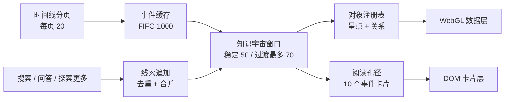

# 4D 知识宇宙重构实施计划

> 状态：已实施并通过浏览器交互验收；真实生产结构见
> [知识宇宙架构](../../architecture/knowledge-universe.md)
>
> 日期：2026-07-18
>
> 取代：[2026-07-15 下一代 4D 知识探索工作台](2026-07-15-next-generation-knowledge-atlas.md)
>
> 交付原则：不保留旧交互、旧偏好或旧状态机兼容层；新实现验收后一次切换并删除旧路径

## 1. 最终结论

知识宇宙只保留一套事实、一套配置和一套渲染器，但明确区分两种互斥的工作状态：

- **时空探索态**：在单一信息源内沿时间或叙事顺序飞行。重点是远近、先后、持续推进和快速回退。
- **线索累积态**：把搜索、问答和“探索更多”产生的事实增量汇入临时线索图谱。重点是稳定关系、连续追问和线索整理。

两种状态共享：

- 同一事件—实体事实模型；
- 同一事件缓存、场景窗口和卡片预览配置；
- 同一对象注册表、渲染资源和关系高亮规则；
- 同一实体类型与文档范围过滤。

两种状态不同：

- 时空探索态从时间线分页读取事实，执行前后预取，使用时间纵深投影；
- 线索累积态只接收搜索、问答和主动拓展显式返回的事实，不预取未知知识，使用稳定增量布局。

搜索、问答和主动拓展是**事实来源**，不是场景状态。当前实现
`activationOrigin === "browse" ? "exploration" : "accumulation"` 必须删除，状态只能由显式状态机决定。

## 2. 范围与非目标

### 2.1 本次必须交付

1. 从探索入口默认进入知识宇宙主页，而不是恢复一个不透明的旧场景。
2. 主页展示自然、克制、微旋转的信息源星云；进入后保持同一形态连续拉近，不爆炸、不破碎、不闪切。
3. 时空探索形成完整生命周期：
   `远处粒子 → 小星星 → 星星与完整小卡片 → 正常卡片 → 边缘模糊淡出`。
4. 网络分页、事件缓存、场景窗口、卡片预览彻底分层。
5. 搜索、问答和主动拓展进入同一线索累积态，多轮结果去重后持续追加并连线。
6. 累积图谱中旧节点稳定，新批次从阅读前景进入；窗口满后按事件 FIFO 退出。
7. hover、锁定、详情、AI 问答、探索更多、清除焦点和退出状态职责明确。
8. 默认 50 个事件窗口和过渡期最多 70 个事件组在生产基准设备上稳定渲染。
9. 删除旧状态推导、旧卡片双开关、旧偏好版本和依赖源码字符串的结构测试。

### 2.2 本次不做

- 不新建第二套知识图谱或复制事实数据；
- 不引入关系权重、桥接保护、LRU、复杂缓存热度算法；
- 不在累积态后台猜测用户下一步并预取知识；
- 不让 hover 触发网络请求；
- 不把所有缓存数据变成 Three.js、DOM 或 GPU 对象；
- 不用持续力导向模拟制造“灵动感”；
- 不恢复左侧长详情面板；详情继续使用现有 mini 面板；
- 不保留 v5 偏好、旧交互或双渲染路径的运行时兼容。

## 3. 产品状态与交互契约

### 3.1 页面层级

知识宇宙外壳有两个页面层级，进入信息源会话后才有两种工作状态：

```text
知识宇宙主页
  └─ 选择信息源 / hover 后滚轮进入
      └─ 信息源探索会话
          ├─ 时空探索态
          └─ 线索累积态
```

- 从普通面板点击“探索”，始终进入知识宇宙主页。
- 主页选择信息源后，星云平滑移动到镜头中心并适度放大，进入时空探索态。
- 时空探索回退到时间起点后继续回退，平滑拉远为信息源星云，再回到主页。
- 从累积态退出时，先恢复进入前保存的探索现场；不会直接丢失会话或跳到主页。

### 3.2 状态转移

| 当前状态 | 用户动作 | 结果 |
|---|---|---|
| 主页 | 选择信息源或对已聚焦星云向前滚动 | 创建信息源探索会话，进入时空探索态 |
| 时空探索 | 普通滚轮 | 沿时间轴推进或回退 |
| 时空探索 | 搜索、问答、探索更多产生事实 | 保存探索快照，进入线索累积态并追加一批线索 |
| 线索累积 | 后续搜索、问答、探索更多 | 去重后增量追加，不重建旧图 |
| 线索累积 | 点击节点或卡片 | 锁定；再次点击同一对象解除锁定 |
| 任一会话态 | 点击空白 | 只清除 hover/锁定/mini 面板，不请求数据、不刷新、不退出状态 |
| 线索累积 | 底部“返回探索” | 恢复原信息源、时间位置、缓存、过滤和相机 |
| 时空探索 | 回退越过会话入口，或点击左上返回 | 回到知识宇宙主页 |

进入累积态时保存一个不可变 `ExplorationSnapshot`：

- `sourceId` 与数据快照版本；
- 当前时间锚点、方向和窗口成员；
- 事件缓存引用；
- 相机位置、目标点和空间缩放；
- 文档范围、实体类型过滤；
- 自动播放状态默认为关闭。

恢复时只重放这份快照，不重新查询第一页，不重新计算整场布局。

### 3.3 输入职责

| 输入 | 时空探索态 | 线索累积态 |
|---|---|---|
| 普通滚轮 | 时间推进/回退，带 400–650ms 衰减惯性 | 正常空间缩放 |
| Ctrl/Cmd + 滚轮、触控板 pinch | 空间缩放 | 空间缩放 |
| 拖动 | 环视/平移，并立即刹停时间惯性 | 环视/平移 |
| hover 节点 | 显示并高亮完整一跳事实网络，不请求 | 同左 |
| 点击节点/卡片 | 锁定或解除锁定 | 锁定或解除锁定 |
| 点击空白 | 清焦点 | 清焦点 |
| 自动播放 | 显式开启后按稳定速度推进 | 不提供 |

无用户输入时：

- 相机、卡片和数据节点保持稳定；
- 只有远景星云做低幅、低频呼吸与微旋转；
- `prefers-reduced-motion` 下关闭惯性、漂移和非必要粒子运动。

### 3.4 卡片与详情

- 事件星与相关实体默认一起构成网络，不能单独关闭某一类节点。
- “启用卡片”是一个联合开关：控制事件与实体卡片，不影响节点与关系是否存在。
- 卡片内容作为一个整体出现：元信息、标题和摘要同时存在，只整体缩放与渐显，禁止先标题后摘要造成跳变。
- hover 卡片时露出“查看详情”“探索更多”“AI 问答”入口。
- 点击“查看详情”才打开 mini 面板；单击卡片本身只锁定，不立即弹详情。
- mini 面板与锁定状态联动：再次点击同一卡片、点击空白或滚动开始时关闭。
- mini 面板支持上一个/下一个事件，不新增左侧详情面板。
- 发起 AI 问答或探索更多后自动解除当前锁定；返回结果作为新批次进入线索累积态。

## 4. 一套配置

两种状态使用同一个 `KnowledgeUniverseConfiguration`。只暴露用户能理解的容量和显示选择；
帧预算、对象池大小、碰撞迭代次数等工程参数不进入设置。

| 配置 | 默认 | 建议支持范围 | 作用 |
|---|---:|---:|---|
| 事件缓存容量 | 1000 | 200–5000 | 纯数据 FIFO，支持长距离回退 |
| 事件窗口 | 50 | 20–100 | 当前参与场景布局和渲染的事件数 |
| 启用事件与实体卡片 | 开 | 开/关 | 只控制卡片，不删除节点与关系 |
| 事件卡片预览数 | 10 | 0–20，且不大于窗口 | 静止状态最多显示的事件卡片数 |
| 时序分页大小 | 20 | 10–50 | 时空探索网络请求批次 |
| 前后预取页数 | 3 | 0–3 | 时空探索当前窗口前后各预取的页数 |
| 实体类型 | 全部 | 数据提供的类型 | 被过滤实体不显示，也不连线 |
| 文档范围 | 当前信息源全部 | 单文档/多文档/全部 | 同时约束探索、搜索、问答和追加 |

补充规则：

- 卡片预览数只统计事件卡片。实体卡片由事件和焦点关系带出，不占事件预览名额。
- 实体卡片仍受内部碰撞和 DOM 安全上限约束；溢出实体保持高亮星点并显示数量，不让卡片墙突破屏幕。
- 配置值持久化为 v6；不迁移 v5，首次加载 v6 时直接使用新默认值。
- 设置面板同时展示配置值和当前实际值；如果设备能力不足，只允许在明确提示原因后降低实际值，禁止静默截断。

## 5. 数据模型

### 5.1 原子事实

前端唯一接收和流转的场景数据单位是不可变 `EventBundle`：

```ts
type EventBundle = {
  event: UniverseEvent;
  entities: UniverseEntity[];
  relations: UniverseRelation[];
  sourceId: string;
  documentId?: string;
  temporalKey: string;
};
```

事件进入时，其相关实体和事件—实体关系必须原子进入。过滤实体类型后：

- 被过滤实体不创建节点；
- 与被过滤实体相连的关系不创建线；
- 事件本身仍可存在；
- 事件没有任何可见实体时，不制造虚假占位关系。

### 5.2 三层容量



1. **事件缓存**：最多 1000 个 `EventBundle`，只保存数据。
2. **知识宇宙窗口**：稳定态最多 50 个事件组；过渡期最多额外保留一页 20 个进出组。
3. **卡片预览**：默认最多 10 个事件卡片；不决定节点和连线是否存在。

三层绝不互相代替：

- 网络返回 20 个事件，不等于一次替换 20 个场景节点；
- 缓存有 1000 个事件，不等于创建 1000 个 Three.js 对象；
- 窗口有 50 个事件，不等于显示 50 张卡片。

### 5.3 FIFO 事件缓存

实现为稳定 Map 加进入顺序队列：

```ts
type EventCache = {
  recordsById: Map<string, EventBundle>;
  admissionOrder: string[];
  capacity: number;
};
```

- 同一事件 ID 再次进入时合并实体和关系，不重复排队。
- 超过容量后从队首移除缓存索引。
- 不计算热度、不按距离、不保护桥接节点、不做 LRU。
- 场景窗口持有不可变 `EventBundle` 引用；缓存索引淘汰不会改变当前画面。
- 以后回到已淘汰区域时允许按游标重新请求，这是简单 FIFO 的明确代价。

### 5.4 时空探索窗口

- 时间线页只写缓存和游标状态。
- 用户推进量映射为连续 `timelineProgress`，窗口边界跨过一个事件时才提交一个增量成员变化。
- 新事件从镜头远端中心进入；同量旧事件向边缘淡出。
- 一页可以在数百毫秒内按时间偏移错落进入，但不能 20 个对象同帧突然出现。
- 过渡完成后释放 outgoing 对象并恢复 50 个事件稳定窗口。
- 回退使用同一确定性轨迹的逆过程，不重新随机布局。

### 5.5 线索累积窗口

- 搜索、问答或探索更多返回一批 `EventBundle` 后先执行身份去重和关系合并。
- 整批作为一次 `EvidenceAppend` 提交，不逐节点刷新 React 状态。
- 新批次按返回顺序错落进入当前阅读前景。
- 未退出窗口的旧事件和实体保持世界坐标不变。
- 超过 50 个事件后，最早进入累积窗口的事件按 FIFO 从边缘淡出。
- 实体只要仍被窗口内任一事件引用就保留；引用数归零才退出。
- 如果整批均重复，只显示“没有新增线索”，不移动相机、不重排图谱。

### 5.6 时序预取

预取只属于时空探索态：

- 当前窗口前后各最多 3 页；
- 按距离当前窗口由近到远调度；
- 全局最多一个请求在途；
- 相同游标请求去重；
- 到达一侧时间边界后只预取另一侧；
- 切换信息源、文档范围、实体类型或快照版本时取消旧请求并丢弃迟到响应；
- 用户推进到缓存低水位前开始预取，网络返回不直接触发相机或场景刷新。

线索累积态没有“前后页”。它只消费显式追加结果。

## 6. 渲染与视觉规范

### 6.1 固定背景与数据世界分离

渲染分为三个独立层：

1. **屏幕空间远景**：稀疏背景星、微弱光带、远处星云；不跟随图谱拖动和数据相机 LOD。
2. **WebGL 数据世界**：事件星、实体星、关系线、近景粒子与信息源星云。
3. **DOM 阅读层**：最多受阅读孔径选中的事件卡片和必要实体卡片。

拖动图谱时远景不整体跟着走。主题切换只改变语义 token 和粒子调色板，不重建数据世界。

### 6.2 信息源星云

- 使用自然的偏心旋臂和椭圆盘，不使用正圆“大饼”。
- 金色粒子代表事件潜能，信息源/实体色粒子使用当前语义配色。
- 中心亮核、两至三条不对称旋臂、稀疏外缘和轻微倾角共同形成轮廓。
- 进入信息源时复用同一粒子对象，只改变整体变换和相机，不先破碎再生成另一套粒子。
- 旋转幅度低，停止输入后不会让用户误以为数据在移动。
- Shader attribute 数量必须受 WebGL 最低能力约束；闪烁、相位等可推导量优先由种子和现有属性计算，禁止再次出现 `Too many attributes (aTwinkle)`。

### 6.3 时空探索投影

事件采用确定性锥形纵深：

- 时间越远越靠近镜头中心、越小、越淡；
- 接近阅读区时从粒子稳定过渡为事件星和完整小卡片；
- 越过阅读区后向外围扩散；
- 接近安全视区边缘时降低透明度并增加轻微模糊；
- 离开窗口后才释放对象。

同页事件根据时间键、稳定哈希 lane 和序号产生错落：

- 先出现的先变大；
- 不同 lane 有轻微横向与纵向差异；
- 相同事件正向与回退使用同一轨迹；
- 不允许每次 render 随机新坐标；
- 不运行持续力导向模拟。

### 6.4 线索累积投影

- 首批事实使用一次确定性关系布局。
- 后续批次只为新节点计算插入位置，旧节点不参与全局重算。
- 新节点优先靠近已存在的共享实体；没有连接时进入独立但可见的阅读扇区。
- 相机用 450–700ms 平滑移动把新批次带入前景；用户输入立即取消自动聚焦。
- 普通状态展示克制的真实关系线；hover/锁定时高亮完整一跳，其他节点和线降低透明度。
- 线宽保持细且随深度衰减，禁止用粗线表达重要性。

### 6.5 对象生命周期

`ObjectRegistry` 以稳定 ID 管理事件、实体、关系和 DOM 卡片：

- 缓存写入不创建对象；
- 进入窗口时从对象池取得或创建；
- 窗口内同 ID 对象身份不变；
- hover、锁定和卡片预算变化只修改材质/可见性，不调用全量 `graphData()`；
- outgoing 动画结束后统一回收；
- 高频帧复用数组、Map、向量和几何临时对象，不逐帧分配。

## 7. 前端模块重构

当前主要文件约 1.4 万行，其中：

- `knowledge-universe.tsx`：3836 行；
- `universe-scene-engine.ts`：7151 行；
- 时间窗、工作集和偏好模块合计超过 2500 行。

目标不是机械拆行，而是恢复单向依赖。

### 7.1 会话与数据内核

新增或重写以下纯模块：

| 模块 | 责任 |
|---|---|
| `apps/web/lib/universe-session-state.ts` | 显式主页/会话与 exploration/accumulation 状态机 |
| `apps/web/lib/universe-event-cache.ts` | 纯数据 Map + FIFO、去重、容量 |
| `apps/web/lib/universe-scene-window.ts` | 50/70 事件窗口、进入/退出事务、实体引用计数 |
| `apps/web/lib/universe-prefetch-controller.ts` | 双向游标、低水位、单请求调度、取消与迟到响应隔离 |
| `apps/web/lib/universe-accumulation.ts` | EvidenceAppend 去重、批次顺序、FIFO 与快照恢复 |
| `apps/web/lib/universe-preview-plan.ts` | 阅读孔径、事件卡片 10、焦点接管与碰撞结果 |

现有 `universe-timeline-window.ts`、`universe-working-set.ts` 和
`universe-focus-cards.ts` 中仍有价值的确定性算法迁入上述边界，之后删除重复所有者。

### 7.2 页面协调器

`knowledge-universe.tsx` 最终只负责：

- 读取路由/应用入口；
- 创建和销毁 `UniverseSession`；
- 发起 API 请求并把结果作为事件送入 reducer/controller；
- 接线搜索、问答、探索更多和 mini 面板；
- 渲染场景、顶部导航、底部状态栏和设置抽屉。

它不再：

- 用 `activationOrigin` 推导场景状态；
- 自己维护多个 Map/ref 版本的同一事实；
- 计算节点坐标、卡片预算或对象生命周期；
- 在空白点击时调用 resume/刷新；
- 逐节点写 React state。

### 7.3 场景引擎

保留一个 `UniverseSceneEngine` 生命周期协调器，拆出以下职责：

| 模块 | 责任 |
|---|---|
| `universe-scene-contract.ts` | 版本化命令、快照、事件和只读 presentation |
| `universe-scene-objects.ts` | 对象池、稳定 ID 注册表、资源释放 |
| `universe-scene-camera.ts` | 时间推进、空间缩放、拖动、惯性和自动聚焦 |
| `universe-scene-layout.ts` | 时间锥形投影与稳定累积投影 |
| `universe-scene-cards.ts` | DOM 卡片投影、整体缩放、碰撞、hover 动作 |
| `universe-nebula-layer.ts` | 信息源星云与远景粒子，不读取业务状态 |

探索与累积只提供不同的 placement/presentation 策略，不复制渲染器和对象资源。

### 7.4 设置

`universe-view-preferences.ts` 升级为 v6，只保留：

```ts
type UniverseViewPreferencesV6 = {
  version: 6;
  cacheCapacity: number;
  eventWindowSize: number;
  cardsEnabled: boolean;
  eventCardPreviewCount: number;
  temporalPageSize: number;
  temporalPrefetchPages: number;
  entityTypes: string[];
  documentIds: string[];
};
```

删除：

- `showEventCards` / `showEntityCards` 双开关；
- 按屏幕面积自动决定业务卡片数的 `universeCardBudget`；
- v5 迁移和旧 storage key；
- 两种状态各自一份设置。

## 8. API 与查询契约

时序端点继续使用快照 + keyset 游标，但契约必须满足：

- 默认 `timeline_event_page_size` 从 12 改为 20，并支持设置范围；
- 返回 `previous_cursor`、`next_cursor`、`has_previous`、`has_next`；
- 每个事件原子返回受过滤后的实体和关系；
- 支持 `document_ids`、`entity_types` 和明确时间/叙事排序；
- 返回可用于去重的稳定事件、实体、关系 ID；
- 返回 `snapshot/revision`，范围变化后旧游标失效；
- 查询期间不按节点补发 N+1 详情请求。

搜索、问答和探索更多输出同一个 `EventBundle[]` 适配结果，再进入 `EvidenceAppend`。三条路径不各自实现一套场景追加逻辑。

## 9. 实施阶段

每个阶段必须先有失败测试，再实现，再通过阶段门禁。阶段内可以提交，运行时不保留旧/新双路径。

### 阶段 0：冻结契约与基线

**改动**

- 为本计划中的状态、配置和命令建立 TypeScript contract。
- 记录当前 50 事件高密数据的 FPS、长任务、DOM 节点和 WebGL 对象基线。
- 将现有源码字符串测试改为行为测试清单，暂不扩大旧实现覆盖。

**验收**

- exploration/accumulation 不再由 activation origin 定义。
- 性能基线脚本能重复生成相同 50×8 密集数据。

### 阶段 1：纯数据内核

**改动**

- 实现 `EventCache`、`SceneWindow`、`EvidenceAppend` 和 `PreviewPlan`。
- 确立事件、实体、关系去重键与实体引用计数。
- 统一时序页和累积追加的 `EventBundle`。

**测试**

- FIFO 容量、重复合并、缓存淘汰不破坏当前窗口；
- 50 稳定窗口、20 过渡缓冲、完成后回到 50；
- 共享实体在最后引用退出后才删除；
- 10 个事件卡片上限、焦点接管而不突破；
- 被过滤实体及其连线均不进入窗口。

### 阶段 2：显式会话状态机

**改动**

- 实现主页、信息源会话、探索、累积和快照恢复。
- 搜索/问答/探索更多统一发出 `APPEND_EVIDENCE`。
- 空白点击改为 `CLEAR_FOCUS`。
- 底部累积控制栏提供明确“返回探索”。

**测试**

- 面板入口始终到主页；
- 探索 → 累积 → 多轮追加 → 返回，恢复相同时间与相机；
- 空白点击不刷新、不退出；
- 同一卡片二次点击解除锁定并关闭 mini 面板；
- 问答提交自动解锁。

### 阶段 3：渲染资源与背景隔离

**改动**

- 从 7151 行引擎提取对象注册表、相机、布局、卡片和星云层。
- 屏幕空间背景与数据世界使用独立 transform。
- 所有窗口节点采用稳定对象身份和对象池。
- 解决 Shader attribute 超限，建立 WebGL1/最低属性数门禁。

**验收**

- 拖动数据图谱时远景不整体移动；
- hover/锁定不全量重建图；
- 反复 100 次窗口切换后对象数回落到稳定上限；
- Chrome 不再出现 `Too many attributes`。

### 阶段 4：时空探索

**改动**

- 实现时间推进 reducer、单请求双向预取和连续窗口提交。
- 实现确定性锥形投影、错落出生、整体卡片缩放与边缘淡出。
- 实现同一星云从主页到会话的连续变换。
- 实现回退越过入口后回到主页。

**验收**

- 网络分页不会整页闪切；
- 新事件从远端中心按先后进入，旧事件从边缘退出；
- 正向和回退轨迹互逆，无随机跳位；
- 缓存命中时滚轮反馈在 100ms 内开始；
- 无用户输入时相机停止，只保留远景微动。

### 阶段 5：线索累积

**改动**

- 搜索、问答、探索更多统一批量追加。
- 新批次使用稳定邻接插入，旧节点世界坐标不变。
- 累积窗口使用事件 FIFO；相机只把新批次带到阅读前景。
- 支持多轮问答持续形成越来越完整的线索图谱。

**验收**

- 新增一批不导致全图抖动；
- 重复批次不移动相机；
- 用户操作可以立即取消批次自动聚焦；
- 退出后探索现场完整恢复；
- 累积态没有时间线预取请求。

### 阶段 6：卡片、详情与设置

**改动**

- 联合卡片开关、事件预览数和阅读孔径落地。
- hover 完整一跳高亮，焦点关系接管预览预算。
- 卡片 hover 显示动作，详情按动作打开 mini 面板。
- 设置抽屉收敛为一套配置，保留实体类型与文档范围。
- 偏好直接切换到 v6。

**验收**

- 50 个事件星存在时默认最多 10 个事件卡片；
- 卡片作为整体缩放，不出现元信息/摘要后补导致的跳变；
- 关闭卡片后节点和连线仍完整；
- hover 不发请求；
- 过滤实体不显示也不连线。

### 阶段 7：性能、可访问性与清理

**改动**

- 删除旧 state/ref 所有者、旧偏好、旧卡片预算和重复布局代码。
- 删除依赖源码文本的结构测试，改为状态机、IO 和对象生命周期测试。
- 补充键盘、reduced motion、亮暗主题和失败/空态。
- 实现后重写 `docs/architecture/knowledge-universe.md` 为真实 as-built。

**门禁**

```bash
cd apps/web
npm run test:unit
npm run typecheck
npm run lint
npm run i18n:check
npm run build

cd ../api
. .venv/bin/activate
pytest -q
ruff check .
```

## 10. 性能预算

### 10.1 默认负载

按每事件最多 8 个实体估算：

- 稳定窗口：50 个事件，最多约 450 个节点；
- 过渡窗口：70 个事件，最多约 630 个节点；
- 事件—实体主关系：最多约 560 条，另加去重后的真实共享关系；
- DOM：最多 10 个事件卡片，加受内部安全预算约束的实体卡片；
- 缓存：1000 个纯数据 `EventBundle`，零 Three.js/DOM/GPU 对象。

当前桌面 240 节点 / 360 边预算不足以兑现默认窗口。重构不能靠静默少渲染掩盖问题；
桌面对象池和实例化路径必须至少覆盖 700 节点、1000 关系的默认过渡场景。

### 10.2 生产目标

| 指标 | 目标 |
|---|---|
| 缓存命中滚轮到首帧反馈 | ≤ 100ms |
| 稳态帧率（基准桌面 Chrome） | 目标 60 FPS，P95 帧 ≤ 20ms |
| 高密过渡最低帧率 | ≥ 30 FPS，不出现连续 200ms 长任务 |
| 网络并发 | 时序预取最多 1 个请求 |
| 场景空白帧 | 0 |
| 卡片事件 DOM 上限 | 配置默认 10，任何焦点不得突破 |
| 窗口对象 | 稳定后回到 50 个事件组 |
| 长时间探索 | 连续 100 页后对象数和监听器数稳定，无单调增长 |
| 累积追加 | 未退出窗口的旧节点位置误差为 0 |
| 主题/拖动 | 不重建事实对象，远景不跟随数据世界 |

移动端不以静默丢事件降级。若设备无法满足配置，设置和状态栏必须显示实际窗口及原因；
默认桌面配置仍必须完整兑现。

## 11. 测试矩阵

### 11.1 纯单元测试

- cache：FIFO、去重、容量变化、缓存淘汰与窗口引用；
- window：正向、回退、过渡中断、50/70 上限、实体引用计数；
- prefetch：前后 3 页、单并发、低水位、取消、迟到响应、边界；
- accumulation：多来源统一追加、整批重复、FIFO、稳定旧坐标；
- preview：10 个事件、焦点接管、实体溢出、卡片关闭；
- filters：文档和实体类型同时作用于节点、线、搜索、问答。

### 11.2 集成测试

- 页面入口 → 主页 → 信息源 → 探索 → 回退 → 主页；
- 探索 → 问答 → 多轮图谱追加 → 探索更多 → 返回探索；
- hover → 锁定 → 详情 → 上下事件 → 二次点击/空白清除；
- 滚轮、Ctrl/Cmd+滚轮、pinch、拖动和自动播放互不抢职责；
- 请求失败保留当前场景并可重试，不清空缓存。

### 11.3 视觉与性能回归

- 深色/浅色主题的星云、事件色和实体色；
- 主页星云、进入、飞行、边缘淡出和回退关键帧截图；
- 50/70 高密场景的卡片碰撞与安全视区；
- Chrome WebGL 最低属性数、集显和高 DPR；
- reduced motion；
- 100 页往返和 30 轮问答追加的堆内存、对象数、监听器数。

## 12. 一次切换与删除清单

新链路验收后同一提交内删除：

- `activationOrigin` 到场景策略的映射；
- `contextGraphSessionRef` / `retainedExplorationRef` 的旧并行所有权；
- 空白点击 `dispatchUniverseResume()`；
- `showEventCards` / `showEntityCards`；
- `universeCardBudget()` 面积预算；
- v5 storage key 和迁移；
- 以完整 visible window 作为 transition headroom 的旧策略；
- hover/锁定触发的全量 `graphData()`；
- 旧背景与数据相机耦合路径；
- 只断言源码包含某段字符串的测试；
- 已被新内核替代的 timeline deque、working set 和 focus-card 重复实现。

不保留 feature flag、双状态机或旧偏好兼容。Git 历史就是回退方案。

## 13. 完成定义

只有同时满足以下条件，重构才算完成：

1. 用户能从主页自然进入星云，持续探索、回退并回到主页，全程无闪切。
2. 50 个事件窗口中只有默认 10 个事件卡片可读，其余仍形成清晰网络。
3. 分页、缓存、窗口和卡片预览四个概念在代码、设置和文案中一致。
4. 多轮搜索、问答和探索更多形成同一个稳定增量线索图谱。
5. 空白点击只清焦点；底部返回明确恢复原探索现场。
6. 新批次进入不重排旧节点，窗口满后严格按事件 FIFO 退出。
7. 默认 50/20/3/1000/10 配置通过性能门禁。
8. 不存在 Shader attribute 错误、场景对象泄漏、监听器增长或整页重建。
9. 新设置只有 v6，一套配置服务两种状态。
10. `docs/architecture/knowledge-universe.md` 已按最终代码重写，旧计划明确标记为历史。
